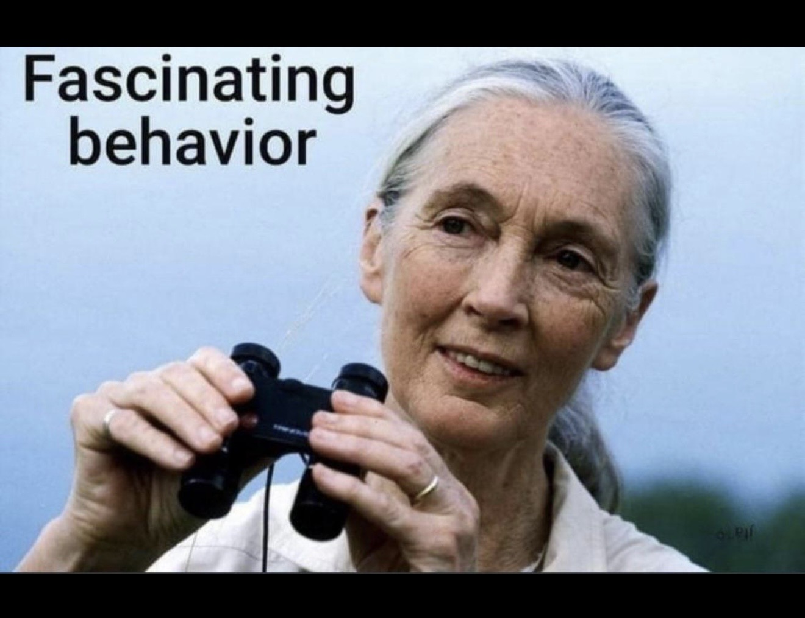

# CODE OF CONDUCT

**1.** When we are wrong, we promptly admit it. It's okay to be wrong, for this is how we learn.

**2.** We don't pretend to know shit we don't know. We express uncertainty instead of presenting guesses as facts.

**3.** If you disagree with an implementation, provide a biophysical rationale from first principles. Fork the repository and provide proof of your implementation.

**4.** We don't credential-check. We care about your ability to think scientifically and logically.

**5.** We do not discriminate based on race, age, gender, sexual identity, or other personal characteristics.

**6.** We maintain respect. No harassment, no personal attacks. Disagree with ideas, not people.

**7.** We do not gatekeep. If you genuinely want to learn and contribute, we will help you onboard.

**8.** We say no to extractors. We support open science, not consultants who get paid to take from others and provide nothing in return.

**9.** When conflicts arise, we remember that it is not one individual versus another. It's the team versus the problem. We are on the same side, united against our common goal.

**10.** We embody the spirit of personal agency and responsibility. You can just do things.

---

  <em>"Fascinating behavior"</em>
   
   
  

