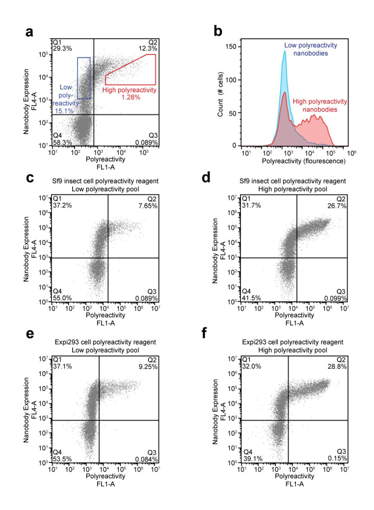
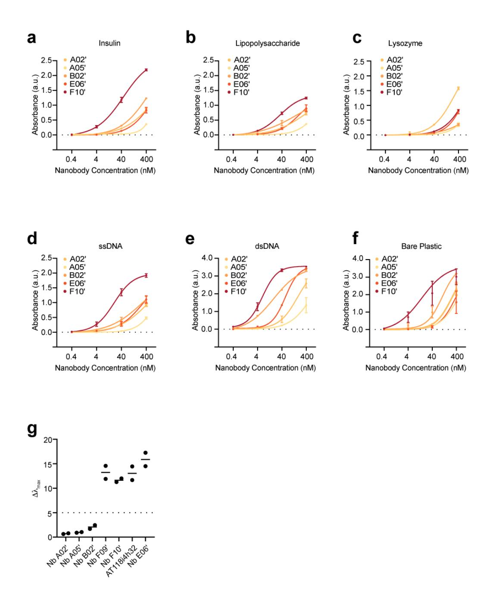
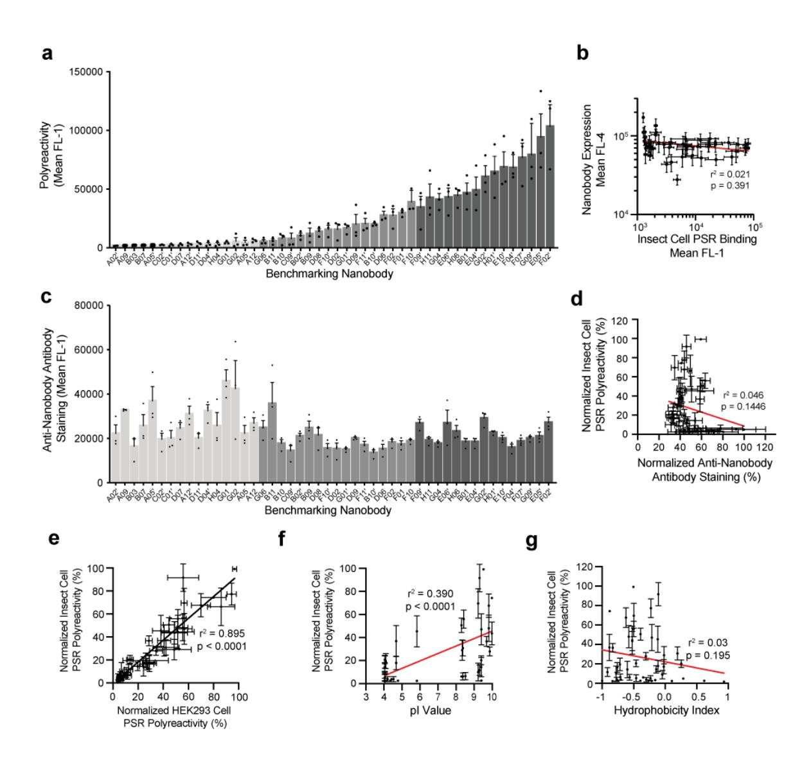
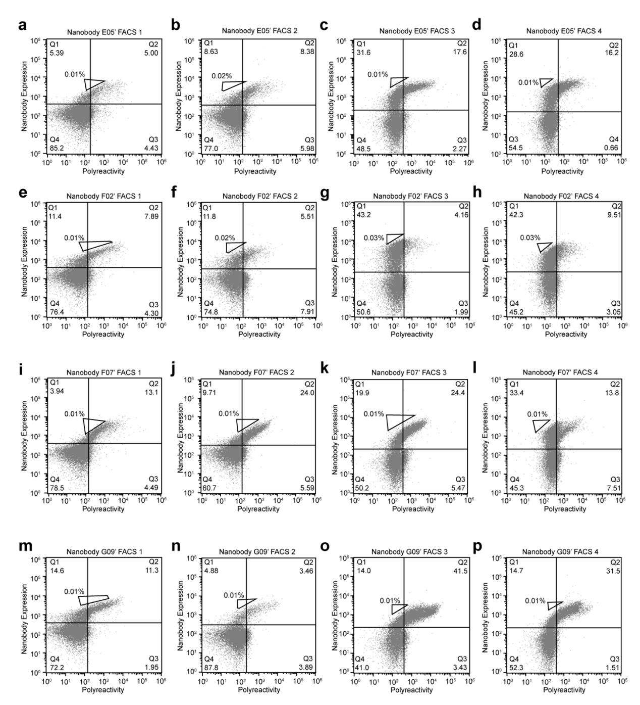
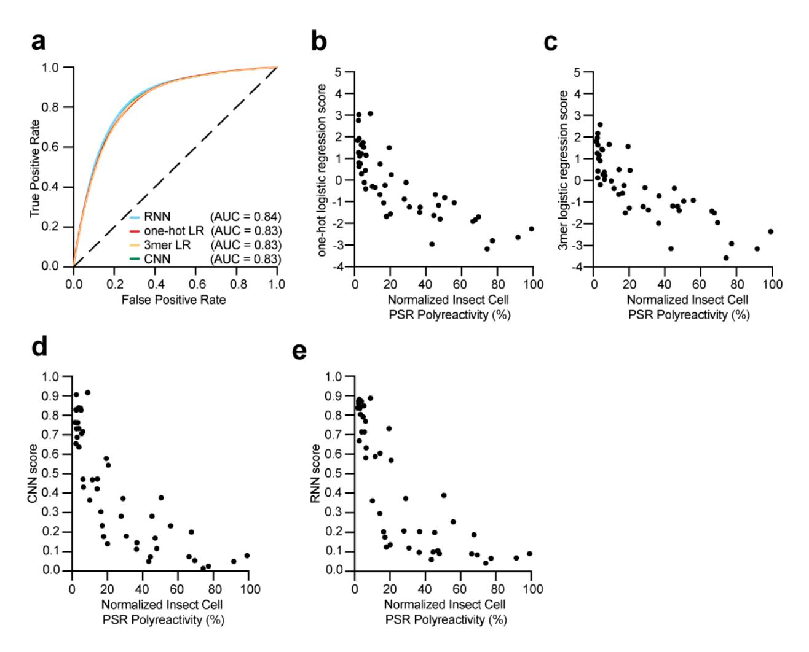

**Supplementary Figure 1. FACS Gating strategies. a**, the nanobody library enriched for PSR binders via MACS was stained with biotinylated insect cell PSR reagent, followed by AlexaFlour-647 conjugated αHA-antibody to assess nanobody expression on the yeast cell surface and AlexaFlour-488 conjugated streptavidin. Highly expressing yeast representing the low polyreactivity (PSR negative) and high polyreactivity (PSR positive) populations were collected. **b**, Analytical flow cytometry staining illustrates the difference in polyreactivity between the low polyrectivity and high polyreactivity nanobody pools. Low and high polyreactivity pools were concurrently stained with insect cell PSR reagent (**cd)** and HEK293 PSR reagent (**e-f**), demonstrating a similar level of binding to both PSR reagents.

**Supplementary Figure 2. ELISA assessment of polyreactivity. a-f,** Polyreactivity of index panel members as measured by nanobody binding to the indicated reagents in direct ELISAs. Data are mean +/- SEM of two independent experiments, each performed with technical triplicates. **g,** Self association of index panel members as measured by AC-SINS. Data are the max wavelength shift observed and are representative of results obtained in two independent experiments.

**Supplementary Figure 3. Benchmarking nanobody set. a,** Raw insect cell PSR staining of yeast displaying polyreactivity index panel members. Data are mean +/- SEM of three independent biological replicates performed in technical duplicate. **b,** Insect cell PSR staining is not correlated with nanobody expression. **c,** Anti-nanobody antibody staining of yeast displaying polyreactivity index panel members, indicating that all panel members are folded. Data are mean +/- SEM of three independent biological experiments performed in technical triplicate. **d,** anti-nanobody antibody staining is not correlated with insect cell PSR staining (r2 = 0.046). **e,** Insect cell PSR staining of index panel members is well correlated with HEK293 cell PSR staining, suggesting that polyreactive panel members are not binding to specific proteins in insect cell membranes. HEK293 cell PSR staining data are mean +/- SEM of three independent biological experiments. **f,** Correlation between index panel nanobody pI values and insect cell PSR reagents. Nanobodies with low pI values tend to possess low polyreactivity, while nanobodies with high pI values exhibit a wider range of polyreactivity. **g,** Index panel nanobody hydrophobicity index values and insect cell PSR reagent staining are not correlated.

**Supplementary Figure 4. Evolution of index panel nanobodies using the AHEAD system to reduce polyreactivity. a-d,** Selected FACS plots showing polyreactivity reduction of nanobody E05'. **e-h,** Selected FACS plots showing polyreactivity reduction of nanobody F02'. **i-l,** Selected FACS plots showing polyreactivity reduction of nanobody F07'. **m-p,** Selected FACS plots showing polyreactivity reduction of nanobody G09'.

**Supplementary Figure 5. Polyreactivity of AT118i4 variants. a,** Polyreactivity of noninduced yeast not expressing nanobody, AT118i4h32, AT118i4h32 G26D27 T57I65, and the clinically approved nanobody drug Cablivi, as measured by insect cell PSR staining. Data is representative of three independent experiments. Error bars represent SEM of three technical replicates**. b-g,** Polyreactivity of AT118i4 h32 and AT118i4 h32 G26D27 T57I65, as measured by binding of AT118 variants to the specified reagents by direct ELISA assays. Data are mean +/- SEM and are representative of two independent experiments, each performed with technical triplicates. **h-i**, HEK suspension cells stably expressing AT1R were treated with AT118i4h32-V5-His (purple) or AT118i4h32 G26D27 T57I65-V5-His (blue) and Alexa Flour 647-labeled anti-V5 antibody and analyzed by flow cytometry. Data are representative of three independent experiments. Error bars represent mean +/- SEM of three replicates. Non-specific binding was measured against wild-type HEK suspension cells. The measured Kd for AT118i4h32-V5-His is 58.3 +/- 6.1 nM and 54.0 +/- 7.4 nM for AT118i4h32 G26D27 T57I65-V5-His.

**Supplementary Figure 6. Deep FACS training results. a,** Comparison of supervised models (one-hot and k-mer logistic regression, RNN, CNN) trained on a deeper FACS sort of millions of high and low polyreactive sequences. Sequences were clustered into ten validation clusters and models were trained in cross-fold validation using only sequences greater than 10 mutations away from any test sequence in the training set. **be,** Quantitative predictions of polyreactive compared to the experimentally measured PSR levels of the index set of clones. The one-hot logistic regression, k-mer logistic regression, CNN, and RNN models were trained on the full NGS dataset (except for sequences that had the exact same CDR sequences as sequences in the index set) and were used to predict relative polyreactivity (spearman " of 0.87, 0.86, 0.88, 0.88) respectively.

# **Supplementary Table 1. Nanobody Sequences**

| Name | Sequence                                                                      |
|------|-------------------------------------------------------------------------------|
|      | (Bold = mutation from corresponding parent, only non-synonymous mutations are |
|      | indicated; Italics = CDR3)                                                    |
| A02' | QVQLVESGGGLVQAGGSLRLSCAASGIIFYVYAMGWYRQAPGKERELVASIST                         |
|      | GGSTNYADSVKGRFTISRDNAKNTVYLQMNSLKPEDTAVYYCAADAGVYVISY                         |
|      | LVDYWGQGTQVTVSS                                                               |
| C01' | QVQLVESGGGLVQAGGSLRLSCAASGSIFLLYAMGWYRQAPGKERELVAAITI                         |
|      | GGSTNYADSVKGRFTISRDNAKNTVYLQMNSLKPEDTAVYYCNAPEVIRPYFV                         |
|      | AYDYWGQGTQVTVSS                                                               |
| A05' | QVQLVESGGGLVQAGGSLRLSCAASGSIFRRNAMGWYRQAPGKERELVARISW                         |
|      | SGGSTYYADSVKGRFTISRDNAKNTVYLQMNSLKPEDTAVYYCNADNEDYLKV                         |
|      | QSDMDYWGQGTQVTVSS                                                             |
| A09  | QVQLVESGGGLVQAGGSLRLSCAASGKYNAMGWYRQAPGKEREFVAAISLGGS                         |
|      | TTYYADSVKGRFTISRDNAKNTVYLQMNSLKPEDTAVYYCARDGPYDAHSLED                         |
|      | DYWGQGTQVTVSS                                                                 |
| B07  | QVQLVESGGGLVQAGGSLRLSCAASGFIFHYYVMGWYRQAPGKERELVAAITS                         |
|      | DDSTYADSVKGRFTISRDNAKNTVYLQMNSLKPEDTAVYYCAVDVWYSTDHFS                         |
|      | DYDYWGQGTQVTVSS                                                               |
| H04  | QVQLVESGGGLVQAGGSLRLSCAASGFIFRYNAMGWYRQAPGKERELVATITS                         |
|      | SDGSTYYADSVKGRFTISRDNAKNTVYLQMNSLKPEDTAVYYCAEFWVGVYNH                         |
|      | PGYDYWGQGTQVTVSS                                                              |
| D07  | QVQLVESGGGLVQAGGSLRLSCAASGSTLYGYVMGWYRQAPGKERELVAAITD                         |
|      | SGGSTYYADSVKGRFTISRDNAKNTVYLQMNSLKPEDTAVYYCAADYPYFYYV                         |
|      | KSYDYWGQGTQVTVSS                                                              |
| B03  | QVQLVESGGGLVQAGGSLRLSCAASGRIFSGNAMGWYRQAPGKERELVAAITF                         |
|      | SGGSTNYADSVKGRFTISRDNAKNTVYLQMNSLKPEDTAVYYCNVASSDGYYY                         |
|      | FAIGYGYWGQGTQVTVSS                                                            |
| D04' | QVQLVESGGGLVQAGGSLRLSCAASGSTSWRNAMGWYRQAPGKERELVAAIST                         |
|      | GGNTYYADSVKGRFTISRDNAKNTVYLQMNSLKPEDTAVYYCAAYDASQYGYD                         |
|      | YWGQGTQVTVSS                                                                  |
| A12' | QVQLVESGGGLVQAGGSLRLSCAASGSTFYYYAMGWYRQAPGKERELVAVISW                         |
|      | SGGSTYADSVKGRFTISRDNAKNTVYLQMNSLKPEDTAVYYCAAGAYKPVDTS                         |
|      | DYWGQGTQVTVSS                                                                 |
| C02' | QVQLVESGGGLVQAGGSLRLSCAASGRTFTYNAMGWYRQAPGKERELVARISF                         |
|      | STGSTYYADSVKGRFTISRDNAKNTVYLQMNSLKPEDTAVYYCAVSTTSFGAQ                         |
|      | TGYGPYPYGYWGQGTQVTVSS                                                         |
| D11' | QVQLVESGGGLVQAGGSLRLSCAASGSIFGDNAMGWYRQAPGKERELVATITF                         |
|      | RGAGTYYADSVKGRFTISRDNAKNTVYLQMNSLKPEDTAVYYCAKDYWSAWQN                         |
|      | NGYDYWGQGTQVTVSS                                                              |
| A05  | QVQLVESGGGLVQAGGSLRLSCAGYAMGWYRQAPGKERELVATISGSGGSTYY                         |
|      | ADSVKGRFTISRDNAKNTVYLQMNSLKPEDTAVYYCAAAYWDYSYEYYYWGQG                         |
|      | TQVTVSS                                                                       |
| C09' | QVQLVESGGGLVQAGGSLRLSCAASGRIFGRNAMGWYRQAPGKERELVAAISW                         |
|      | SGGNTYYADSVKGRFTISRDNAKNTVYLQMNSLKPEDTAVYYCAKDVSYPYKV                         |
|      | TWHYQYDYWGQGTQVTVSS                                                           |

| G01  | QVQLVESGGGLVQAGGSLRLSCAASGIIFNGYAMGWYRQAPGKERELVAAITD |
|------|-------------------------------------------------------|
|      | DGTSTYYADSVKGRFTISRDNAKNTVYLQMNSLKPEDTAVYYCAADGGLVDFY |
|      | YWGQGTQVTVSS                                          |
| G06  | QVQLVESGGGLVQAGGSLRLSCAASGSTFGANTMGWYRQAPGKERELVAAISW |
|      | SGGTTYYADSVKGRFTISRDNAKNTVYLQMNSLKPEDTAVYYCARYKYPADYG |
|      | YWGQGTQVTVSS                                          |
| B11  | QVQLVESGGGLVQAGGSLRLSCAASGSTFSSNAMGWYRQAPGKERELVASINS |
|      | GDSTYYADSVKGRFTISRDNAKNTVYLQMNSLKPEDTAVYYCAVVRFGTRPSH |
|      | IRHTHEYYYWGQGTQVTVSS                                  |
| B10  | QVQLVESGGGLVQAGGSLRLSCAASGSIFVYNAMGWYRQAPGKERELVAAITY |
|      | SGDDTYYADSVKGRFTISRDNAKNTVYLQMNSLKPEDTAVYYCAAEYVEGVLS |
|      | IYGRSWVYNTYDYWGQGTQVTVSS                              |
| A12  | QVQLVESGGGLVQAGGSLRLSCAASGRIFSGYAMGWYRQAPGKERELVATITY |
|      | TGGSTYYADSVKGRFTISRDNAKNTVYLQMNSLKPEDTAVYYCNTSPYYVADL |
|      | RYYYWGQGTQVTVSS                                       |
| G02  | QVQLVESGGGLVQAGGSLRLSCAASGSILLPYAMGWYRQAPGKERELVATISS |
|      | SGGSTYYADSVKGRFTISRDNAKNTVYLQMNSLKPEDTAVYYCAVEQYSNYLE |
|      | NDYWGQGTQVTVSS                                        |
| B09  | QVQLVESGGGLVQAGGSLRLSCAASGSIFVDNAMGWYRQAPGKERELVASITW |
|      | RGGRTSYADSVKGRFTISRDNAKNTVYLQMNSLKPEDTAVYYCNKVSYRSWYY |
|      | PAFDYWGQGTQVTVSS                                      |
| B02' | QVQLVESGGGLVQAGGSLRLSCAASGSTFTYNTMGWYRQAPGKERELVASISS |
|      | TGGSTYYADSVKGRFTISRDNAKNTVYLQMNSLKPEDTAVYYCAKTGVRARYP |
|      | YRWGDYDYWGQGTQVTVSS                                   |
| B02  | QVQLVESGGGLVQAGGSLRLSCAASGSTFGLYAMGWYRQAPGKERELVAAITW |
|      | SGGTTYYADSVKGRFTISRDNAKNTVYLQMNSLKPEDTAVYYCAAEVYTYYWY |
|      | SYYYWGQGTQVTVSS                                       |
| D08  | QVQLVESGGGLVQAGGSLRLSCAASGSTFGTYAMGWYRQAPGKERELVAAISG |
|      | GGNTNYADSVKGRFTISRDNAKNTVYLQMNSLKPEDTAVYYCAADWYTYTWGF |
|      | GYSIYYYWGQGTQVTVSS                                    |
| F10' | QVQLVESGGGLVQAGGSLRLSCAASGSTFWWYAMGWYRQAPGKERELVATISR |
|      | GGSTNYADSVKGRFTISRDNAKNTVYLQMNSLKPEDTAVYYCARKTRDIRLDY |
|      | WGQGTQVTVSS                                           |
| G01' | QVQLVESGGGLVQAGGSLRLSCAASGITFDRYVMGWYRQAPGKEREFVAVISR |
|      | GGRTYYADSVKGRFTISRDNAKNTVYLQMNSLKPEDTAVYYCAASVLLYWYWG |
|      | EDDYWGQGTQVTVSS                                       |
| B10' | QVQLVESGGGLVQAGGSLRLSCAASGFIFYYNAMGWYRQAPGKERELVAAITW |
|      | GGGSTYYADSVKGRFTISRDNAKNTVYLQMNSLKPEDTAVYYCNVLFIAQGSG |
|      | WTYDYWGQGTQVTVSS                                      |
| F11' | QVQLVESGGGLVQAGGSLRLSCAASGSTFHHYAMGWYRQAPGKERELVAAITT |
|      | SGGRTYYADSVKGRFTISRDNAKNTVYLQMNSLKPEDTAVYYCAADRFFYRGG |
|      | YYYWGQGTQVTVSS                                        |
| D09  | QVQLVESGGGLVQAGGSLRLSCAASGRTFHWNAMGWYRQAPGKERELVADITS |
|      | GGSTYYADSVKGRFTISRDNAKNTVYLQMNSLKPEDTAVYYCAADWFIWWRDD |
|      | YYAGYDLYDYWGQGTQVTVSS                                 |

| F02  | QVQLVESGGGLVQAGGSLRLSCAASGRIFYSNAMGWYRQAPGKERELVAAITF |
|------|-------------------------------------------------------|
|      | SGASTYYADSVKGRFTISRDNAKNTVYLQMNSLKPEDTAVYYCAAEHYNWVSS |
|      | YRYYYWGQGTQVTVSS                                      |
| F01  | QVQLVESGGGLVQAGGSLRLSCAASGFIFDSYAMGWYRQAPGKERELVAAITS |
|      | SGGTTYYADSVKGRFTISRDNAKNTVYLQMNSLKPEDTAVYYCAVRSTFRWYG |
|      | YYYWGQGTQVTVSS                                        |
| D06  | QVQLVESGGGLVQAGGSLRLSCAASGRIFGYYAMGWYRQAPGKERELVAVIRG |
|      | GVSTNYADSVKGRFTISRDNAKNTVYLQMNSLKPEDTAVYYCNARRYWAFNAY |
|      | SKYDYWGQGTQVTVSS                                      |
| F09' | QVQLVESGGGLVQAGGSLRLSCAASGGTFVRYAMGWYRQAPGKERELVAAISS |
|      | RGDRTYYADSVKGRFTISRDNAKNTVYLQMNSLKPEDTAVYYCNTVYYTDSEY |
|      | DSWGQGTQVTVSS                                         |
| G04  | QVQLVESGGGLVQAGGSLRLSCAASGRIFTGNAMGWYRQAPGKEREFVAAISN |
|      | SGGSTYYADSVKGRFTISRDNAKNTVYLQMNSLKPEDTAVYYCAASYRVKWKY |
|      | NYWGQGTQVTVSS                                         |
| E06' | QVQLVESGGGLVQAGGSLRLSCAASGGTIAYNAMGWYRQAPGKERELVAAISS |
|      | SGGRTYYADSVKGRFTISRDNAKNTVYLQMNSLKPEDTAVYYCATPVTNGFDY |
|      | WGQGTQVTVSS                                           |
| H06  | QVQLVESGGGLVQAGGSLRLSCAASGSIFYTYAMGWYRQAPGKERELVAAITS |
|      | TGARTYYADSVKGRFTISRDNAKNTVYLQMNSLKPEDTAVYYCNALSRAGALK |
|      | YGGPNDYWGQGTQVTVSS                                    |
| F10  | QVQLVESGGGLVQAGGSLRLSCAASGSTFLLYAMGWYRQAPGKERELVAAISW |
|      | SGSRTYYADSVKGRFTISRDNAKNTVYLQMNSLKPEDTAVYYCAARSGFAGYG |
|      | YWGQGTQVTVSS                                          |
| H11  | QVQLVESGGGLVQAGGSLRLSCAASGSTFRYYAMGWYRQAPGKERELVAAITR |
|      | SGASTYYADSVKGRFTISRDNAKNTVYLQMNSLKPEDTAVYYCAARSKWNYGR |
|      | YEYWGQGTQVTVSS                                        |
| B01  | QVQLVESGGGLVQAGGSLRLSCAASGSTFTNYAMGWYRQAPGKERELVAAISN |
|      | NGGRTYYADSVKGRFTISRDNAKNTVYLQMNSLKPEDTAVYYCNARIYQGVYV |
|      | RWYGYWGQGTQVTVSS                                      |
| E04' | QVQLVESGGGLVQAGGSLRLSCAASGFTFGSYAMGWYRQAPGKERELVAAITI |
|      | SGSSTYYADSVKGRFTISRDNAKNTVYLQMNSLKPEDTAVYYCNAYWGRGYKT |
|      | EYYYWGQGTQVTVSS                                       |
| G02' | QVQLVESGGGLVQAGGSLRLSCAASGRIFSRNAMGWYRQAPGKERELVAAITQ |
|      | SGGSTYYADSVKGRFTISRDNAKNTVYLQMNSLKPEDTAVYYCAAVKYWEYDY |
|      | WGQGTQVTVSS                                           |
| H01' | QVQLVESGGGLVQAGGSLRLSCAASGRIFGRNTMGWYRQAPGKERELVAAIRS |
|      | GGSTSYADSVKGRFTISRDNAKNTVYLQMNSLKPEDTAVYYCNVKSYRYLKDG |
|      | TFTRKYDYWGQGTQVTVSS                                   |
| F04' | QVQLVESGGGLVQAGGSLRLSCAASGSIFRYYAMGWYRQAPGKERELVAAINS |
|      | RGTSTYYADSVKGRFTISRDNAKNTVYLQMNSLKPEDTAVYYCNKLVYRYGSY |
|      | LEMDYWGQGTQVTVSS                                      |
| E10' | QVQLVESGGGLVQAGGSLRLSCAASGRIFSHYAMGWYRQAPGKEREFVAAISA |
|      | DGGSTYYADSVKGRFTISRDNAKNTVYLQMNSLKPEDTAVYYCAARKYYRTNG |
|      | YWGQGTQVTVSS                                          |

| SGASTYYADSVKGRFTISRDNAKNTVYLQMNSLKPEDTAVYYCATRYSRSYRS RDYYYWGQGTQVTVSS QVQLVESGGGLVQAGGSLRLSCAASGITFQRYAMGWYRQAPGKERELVASISR G09' SGGSTYYADSVKGRFTISRDNAKNTVYLQMNSLKPEDTAVYYCAARYIVRGGY WGQGTQVTVSS QVQLVESGGGLVQAGGSLRLSCAASGYIFVKYAMGWYRQAPGKERELVAAISR E05' SGVRTYYADSVKGRFTISRDNAKNTVYLQMNSLKPEDTAVYYCNAYFYANDYW GQGTQVTVSS QVQLVESGGGLVQAGGSLRLSCAASGSTFSRNTMGWYRQAPGKERELVAAISK F02' SGGRTYYADSVKGRFTISRDNAKNTVYLQMNSLKPEDTAVYYCNAAVYAYASD YWGQGTQVTVSS QVQLVESGGGLVQAGGSLRLSCAASDRIFGYYAMGWYRQAPGKERELVAVIRG D06 G26D27 GVSTNYADSVKGRFTISRDNAKNTVYLQMNSLKPEDTAVYYCNARRYWAFNAY SKYDYWGQGTQVTVSS QVQLVESGGGLVQAGGSLRLSCAASGRIFGYYAMGWYRQAPGKERELVAVIRG D06 T57D65 GVSDNYADSVKGRFTISRDNAKNTVYLQMNSLKPEDTAVYYCNARRYWAFNAY SKYDYWGQGTQVTVSS QVQLVESGGGLVQAGGSLRLSCAASDRIFGYYAMGWYRQAPGKERELVAVIRG D06 G26D27 GVSDNYADSVKGRFTISRDNAKNTVYLQMNSLKPEDTAVYYCNARRYWAFNAY T57D65 SKYDYWGQGTQVTVSS QVQLVESGGGLVQAGGSLRLSCAASGRIFGYGAMGWYRQAPGKERELVAVIRG D06 Y32G37 GVSTNYADSVKGRFTISRDNAKNTVYLQMNSLKPEDTAVYYCNARRYWAFNAY SKYDYWGQGTQVTVSS QVQLVESGGGLVQAGGSLRLSCAASGRIFGYYAMGWYRQAPGKERELVAVIVG D06 R52V57 GVSTNYADSVKGRFTISRDNAKNTVYLQMNSLKPEDTAVYYCNARRYWAFNAY SKYDYWGQGTQVTVSS QVQLVESGGGLVQAGGSLRLSCAASGRIFGYGAMGWYRQAPGKERELVAVIVG D06 Y32G37 GVSTNYADSVKGRFTISRDNAKNTVYLQMNSLKPEDTAVYYCNARRYWAFNAY |
|--------------------------------------------------------------------------------------------------------------------------------------------------------------------------------------------------------------------------------------------------------------------------------------------------------------------------------------------------------------------------------------------------------------------------------------------------------------------------------------------------------------------------------------------------------------------------------------------------------------------------------------------------------------------------------------------------------------------------------------------------------------------------------------------------------------------------------------------------------------------------------------------------------------------------------------------------------------------------------------------------------------------------------------------------------------------------------------------------------------------------------------------------------------------------------------------------------------------------------------------------------------------------------------------------------------------------------------------------------------------------------------------------------------------------------------|
|                                                                                                                                                                                                                                                                                                                                                                                                                                                                                                                                                                                                                                                                                                                                                                                                                                                                                                                                                                                                                                                                                                                                                                                                                                                                                                                                                                                                                                      |
|                                                                                                                                                                                                                                                                                                                                                                                                                                                                                                                                                                                                                                                                                                                                                                                                                                                                                                                                                                                                                                                                                                                                                                                                                                                                                                                                                                                                                                      |
|                                                                                                                                                                                                                                                                                                                                                                                                                                                                                                                                                                                                                                                                                                                                                                                                                                                                                                                                                                                                                                                                                                                                                                                                                                                                                                                                                                                                                                      |
|                                                                                                                                                                                                                                                                                                                                                                                                                                                                                                                                                                                                                                                                                                                                                                                                                                                                                                                                                                                                                                                                                                                                                                                                                                                                                                                                                                                                                                      |
|                                                                                                                                                                                                                                                                                                                                                                                                                                                                                                                                                                                                                                                                                                                                                                                                                                                                                                                                                                                                                                                                                                                                                                                                                                                                                                                                                                                                                                      |
|                                                                                                                                                                                                                                                                                                                                                                                                                                                                                                                                                                                                                                                                                                                                                                                                                                                                                                                                                                                                                                                                                                                                                                                                                                                                                                                                                                                                                                      |
|                                                                                                                                                                                                                                                                                                                                                                                                                                                                                                                                                                                                                                                                                                                                                                                                                                                                                                                                                                                                                                                                                                                                                                                                                                                                                                                                                                                                                                      |
|                                                                                                                                                                                                                                                                                                                                                                                                                                                                                                                                                                                                                                                                                                                                                                                                                                                                                                                                                                                                                                                                                                                                                                                                                                                                                                                                                                                                                                      |
|                                                                                                                                                                                                                                                                                                                                                                                                                                                                                                                                                                                                                                                                                                                                                                                                                                                                                                                                                                                                                                                                                                                                                                                                                                                                                                                                                                                                                                      |
|                                                                                                                                                                                                                                                                                                                                                                                                                                                                                                                                                                                                                                                                                                                                                                                                                                                                                                                                                                                                                                                                                                                                                                                                                                                                                                                                                                                                                                      |
|                                                                                                                                                                                                                                                                                                                                                                                                                                                                                                                                                                                                                                                                                                                                                                                                                                                                                                                                                                                                                                                                                                                                                                                                                                                                                                                                                                                                                                      |
|                                                                                                                                                                                                                                                                                                                                                                                                                                                                                                                                                                                                                                                                                                                                                                                                                                                                                                                                                                                                                                                                                                                                                                                                                                                                                                                                                                                                                                      |
|                                                                                                                                                                                                                                                                                                                                                                                                                                                                                                                                                                                                                                                                                                                                                                                                                                                                                                                                                                                                                                                                                                                                                                                                                                                                                                                                                                                                                                      |
|                                                                                                                                                                                                                                                                                                                                                                                                                                                                                                                                                                                                                                                                                                                                                                                                                                                                                                                                                                                                                                                                                                                                                                                                                                                                                                                                                                                                                                      |
|                                                                                                                                                                                                                                                                                                                                                                                                                                                                                                                                                                                                                                                                                                                                                                                                                                                                                                                                                                                                                                                                                                                                                                                                                                                                                                                                                                                                                                      |
|                                                                                                                                                                                                                                                                                                                                                                                                                                                                                                                                                                                                                                                                                                                                                                                                                                                                                                                                                                                                                                                                                                                                                                                                                                                                                                                                                                                                                                      |
|                                                                                                                                                                                                                                                                                                                                                                                                                                                                                                                                                                                                                                                                                                                                                                                                                                                                                                                                                                                                                                                                                                                                                                                                                                                                                                                                                                                                                                      |
|                                                                                                                                                                                                                                                                                                                                                                                                                                                                                                                                                                                                                                                                                                                                                                                                                                                                                                                                                                                                                                                                                                                                                                                                                                                                                                                                                                                                                                      |
|                                                                                                                                                                                                                                                                                                                                                                                                                                                                                                                                                                                                                                                                                                                                                                                                                                                                                                                                                                                                                                                                                                                                                                                                                                                                                                                                                                                                                                      |
|                                                                                                                                                                                                                                                                                                                                                                                                                                                                                                                                                                                                                                                                                                                                                                                                                                                                                                                                                                                                                                                                                                                                                                                                                                                                                                                                                                                                                                      |
|                                                                                                                                                                                                                                                                                                                                                                                                                                                                                                                                                                                                                                                                                                                                                                                                                                                                                                                                                                                                                                                                                                                                                                                                                                                                                                                                                                                                                                      |
|                                                                                                                                                                                                                                                                                                                                                                                                                                                                                                                                                                                                                                                                                                                                                                                                                                                                                                                                                                                                                                                                                                                                                                                                                                                                                                                                                                                                                                      |
|                                                                                                                                                                                                                                                                                                                                                                                                                                                                                                                                                                                                                                                                                                                                                                                                                                                                                                                                                                                                                                                                                                                                                                                                                                                                                                                                                                                                                                      |
|                                                                                                                                                                                                                                                                                                                                                                                                                                                                                                                                                                                                                                                                                                                                                                                                                                                                                                                                                                                                                                                                                                                                                                                                                                                                                                                                                                                                                                      |
|                                                                                                                                                                                                                                                                                                                                                                                                                                                                                                                                                                                                                                                                                                                                                                                                                                                                                                                                                                                                                                                                                                                                                                                                                                                                                                                                                                                                                                      |
|                                                                                                                                                                                                                                                                                                                                                                                                                                                                                                                                                                                                                                                                                                                                                                                                                                                                                                                                                                                                                                                                                                                                                                                                                                                                                                                                                                                                                                      |
|                                                                                                                                                                                                                                                                                                                                                                                                                                                                                                                                                                                                                                                                                                                                                                                                                                                                                                                                                                                                                                                                                                                                                                                                                                                                                                                                                                                                                                      |
|                                                                                                                                                                                                                                                                                                                                                                                                                                                                                                                                                                                                                                                                                                                                                                                                                                                                                                                                                                                                                                                                                                                                                                                                                                                                                                                                                                                                                                      |
| R52V57 SKYDYWGQGTQVTVSS                                                                                                                                                                                                                                                                                                                                                                                                                                                                                                                                                                                                                                                                                                                                                                                                                                                                                                                                                                                                                                                                                                                                                                                                                                                                                                                                                                                                           |
| QVQLVESGGGLVQAGGSLRLSCAASGRIFGYYAMGWYRQAPGKERELVAVIRG D06                                                                                                                                                                                                                                                                                                                                                                                                                                                                                                                                                                                                                                                                                                                                                                                                                                                                                                                                                                                                                                                                                                                                                                                                                                                                                                                                                                         |
| 109 GVSTNYADSVKGRFTISRDNAKNTVYLQMNSLKPEDTAVYYCNARR Y100-                                                                                                                                                                                                                                                                                                                                                                                                                                                                                                                                                                                                                                                                                                                                                                                                                                                                                                                                                                                                                                                                                                                                                                                                                                                                                                                                                                       |
| WAFNAYSKYDYWGQGTQVTVSS                                                                                                                                                                                                                                                                                                                                                                                                                                                                                                                                                                                                                                                                                                                                                                                                                                                                                                                                                                                                                                                                                                                                                                                                                                                                                                                                                                                                               |
| QVQLVESGGGLVQAGGSLRLSCAASGRIFGYYAMGWYRQAPGKERELVAVIRG D06                                                                                                                                                                                                                                                                                                                                                                                                                                                                                                                                                                                                                                                                                                                                                                                                                                                                                                                                                                                                                                                                                                                                                                                                                                                                                                                                                                         |
| T57D65 GVSDNYADSVKGRFTISRDNAKNTVYLQMNSLKPEDTAVYYCNARR                                                                                                                                                                                                                                                                                                                                                                                                                                                                                                                                                                                                                                                                                                                                                                                                                                                                                                                                                                                                                                                                                                                                                                                                                                                                                                                                                                             |
| 109 WAFNAYSKYDYWGQGTQVTVSS Y100-                                                                                                                                                                                                                                                                                                                                                                                                                                                                                                                                                                                                                                                                                                                                                                                                                                                                                                                                                                                                                                                                                                                                                                                                                                                                                                                                                                                               |
| QVQLVESGGGLVQAGGSLRLSCAASGRIFGYYAMGWYRQAPGKERELVAVIRG D06                                                                                                                                                                                                                                                                                                                                                                                                                                                                                                                                                                                                                                                                                                                                                                                                                                                                                                                                                                                                                                                                                                                                                                                                                                                                                                                                                                         |
| R98D107 GVSTNYADSVKGRFTISRDNAKNTVYLQMNSLKPEDTAVYYCNADRYWAFNAY                                                                                                                                                                                                                                                                                                                                                                                                                                                                                                                                                                                                                                                                                                                                                                                                                                                                                                                                                                                                                                                                                                                                                                                                                                                                                                                                                                     |
| SKYDYWGQGTQVTVSS                                                                                                                                                                                                                                                                                                                                                                                                                                                                                                                                                                                                                                                                                                                                                                                                                                                                                                                                                                                                                                                                                                                                                                                                                                                                                                                                                                                                                     |
| QVQLVESGGGLVQAGGSLRLSCAASGRIFGYYAMGWYRQAPGKERELVAVIRG D06                                                                                                                                                                                                                                                                                                                                                                                                                                                                                                                                                                                                                                                                                                                                                                                                                                                                                                                                                                                                                                                                                                                                                                                                                                                                                                                                                                         |
| R99H108 GVSTNYADSVKGRFTISRDNAKNTVYLQMNSLKPEDTAVYYCNARHYWAFNAY                                                                                                                                                                                                                                                                                                                                                                                                                                                                                                                                                                                                                                                                                                                                                                                                                                                                                                                                                                                                                                                                                                                                                                                                                                                                                                                                                                     |
| SKYDYWGQGTQVTVSS                                                                                                                                                                                                                                                                                                                                                                                                                                                                                                                                                                                                                                                                                                                                                                                                                                                                                                                                                                                                                                                                                                                                                                                                                                                                                                                                                                                                                     |
| QVQLVESGGGLVQAGGSLRLSCAASGRIFGYYAMGWYRQAPGKERELVAVIRG D06                                                                                                                                                                                                                                                                                                                                                                                                                                                                                                                                                                                                                                                                                                                                                                                                                                                                                                                                                                                                                                                                                                                                                                                                                                                                                                                                                                         |
|                                                                                                                                                                                                                                                                                                                                                                                                                                                                                                                                                                                                                                                                                                                                                                                                                                                                                                                                                                                                                                                                                                                                                                                                                                                                                                                                                                                                                                      |
| R98D107 GVSTNYADSVKGRFTISRDNAKNTVYLQMNSLKPEDTAVYYCNARRYWAFNAY                                                                                                                                                                                                                                                                                                                                                                                                                                                                                                                                                                                                                                                                                                                                                                                                                                                                                                                                                                                                                                                                                                                                                                                                                                                                                                                                                                     |

| D06     | QVQLVESGGGLVQAGGSLRLSCAASGRIFGYYAMGWYRQAPGKERELVAVIRG |
|---------|-------------------------------------------------------|
| A97H106 | GVSTNYADSVKGRFTISRDNAKNTVYLQMNSLKPEDTAVYYCNHRRYWAFNAY |
|         | SKYDYWGQGTQVTVSS                                      |
| D06     | QVQLVESGGGLVQAGGSLRLSCAASGRIFGYYAMGWYRQAPGKERELVAVIRG |
| N96W106 | GVSTNYADSVKGRFTISRDNAKNTVYLQMNSLKPEDTAVYYCWARRYWAFNAY |
|         | SKYDYWGQGTQVTVSS                                      |
| D06     | QVQLVESGGGLVQAGGSLRLSCAASGRIFGYYAMGWYRQAPGKERELVAVIRG |
| G54F59  | FVSTNYADSVKGRFTISRDNAKNTVYLQMNSLKPEDTAVYYCNADRYWAFNAY |
| R98D107 | SKYDYWGQGTQVTVSS                                      |
| D06     | QVQLVESGGGLVQAGGSLRLSCAASDRIFGYYAMGWYRQAPGKERELVAVIRG |
| G26D27  | GVSTNYADSVKGRFTISRDNAKNTVYLQMNSLKPEDTAVYYCNADRYWAFNAY |
| R98D107 | SKYDYWGQGTQVTVSS                                      |
| D06     | QVQLVESGGGLVQAGGSLRLSCAASGRIFGYYAMGWYRQAPGKERELVAVIRG |
| G54F59  | FVSTNYADSVKGRFTISRDNAKNTVYLQMNSLKPEDTAVYYCNARRYWAFNAY |
|         | SKYDYWGQGTQVTVSS                                      |
| D06     | QVQLVESGGGLVQAGGSLRLSCAASGRIRGYYAMGWYRQAPGKERELVAVIRG |
| F29R30  | GVSTNYADSVKGRFTISRDNAKNTVYLQMNSLKPEDTAVYYCNARRYWAFNAY |
|         | SKYDYWGQGTQVTVSS                                      |
| D06     | QVQLVESGGGLVQAGGSLRLSCAASGRIRGYYAMGWYRQAPGKERELVAVIRG |
| F29R30  | GVSDNYADSVKGRFTISRDNAKNTVYLQMNSLKPEDTAVYYCNARRYWAFNAY |
| T57D65  | SKYDYWGQGTQVTVSS                                      |
| D06     | QVQLVESGGGLVQAGGSLRLSCAASDRIFGYYAMGWYRQAPGKERELVAVIRG |
| G26D27  | GVSTNYADSVKGRFTISRDNAKNTVYLQMNSLKPEDTAVYYCNHRRYWAFNAY |
| A97H106 | SKYDYWGQGTQVTVSS                                      |
| D06     | QVQLVESGGGLVQAGGSLRLSCAASDRIFGYGAMGWYRQAPGKERELVAVIRG |
| G26D27  | GVSTNYADSVKGRFTISRDNAKNTVYLQMNSLKPEDTAVYYCNARRYWAFNAY |
| Y32G37  | SKYDYWGQGTQVTVSS                                      |
| D06     | QVQLVESGGGLVQAGGSLRLSCAASGRIFGYYAMGWYRQAPGKERELVAVIVG |
| R52V57  | GVSDNYADSVKGRFTISRDNAKNTVYLQMNSLKPEDTAVYYCNARRYWAFNAY |
| T57D65  | SKYDYWGQGTQVTVSS                                      |
| E10'    | QVQLVESGGGLVQAGGSLRLSCAASDRIFSHYAMGWYRQAPGKEREFVAAISA |
| G26D27  | DGGSTYYADSVKGRFTISRDNAKNTVYLQMNSLKPEDTAVYYCAARKYYRTNG |
|         | YWGQGTQVTVSS                                          |
| E10'    | QVQLVESGGGLVQAGGSLRLSCAASGRIRSHYAMGWYRQAPGKEREFVAAISA |
| F29R30  | DGGSTYYADSVKGRFTISRDNAKNTVYLQMNSLKPEDTAVYYCAARKYYRTNG |
|         | YWGQGTQVTVSS                                          |
| E10'    | QVQLVESGGGLVQAGGSLRLSCAASDRIRSHYAMGWYRQAPGKEREFVAAISA |
| G26D27  | DGGSTYYADSVKGRFTISRDNAKNTVYLQMNSLKPEDTAVYYCAARKYYRTNG |
| F29R30  | YWGQGTQVTVSS                                          |
| E10'    | QVQLVESGGGLVQAGGSLRLSCAASGRIFSHGAMGWYRQAPGKEREFVAAISA |
| Y32G37  | DGGSTYYADSVKGRFTISRDNAKNTVYLQMNSLKPEDTAVYYCAARKYYRTNG |
|         | YWGQGTQVTVSS                                          |
| E10'    | QVQLVESGGGLVQAGGSLRLSCAASGRIFSHYAMGWYRQAPGKEREFVAAISA |
| T58D65  | DGGSDYYADSVKGRFTISRDNAKNTVYLQMNSLKPEDTAVYYCAARKYYRTNG |
|         | YWGQGTQVTVSS                                          |

| E10'          | QVQLVESGGGLVQAGGSLRLSCAASGRIFSHYAMGWYRQAPGKEREFVAAISA                 |
|---------------|-----------------------------------------------------------------------|
| Y32G37        | DGGSDYYADSVKGRFTISRDNAKNTVYLQMNSLKPEDTAVYYCAARKYYRTNG                 |
| T58D65        | YWGQGTQVTVSS                                                          |
| E10'          | QVQLVESGGGLVQAGGSLRLSCAASGRIFSHYAMGWYRQAPGKEREFVAAIVA                 |
| S52V57        | DGGSTYYADSVKGRFTISRDNAKNTVYLQMNSLKPEDTAVYYCAARKYYRTNG                 |
|               | YWGQGTQVTVSS                                                          |
| E10'          | QVQLVESGGGLVQAGGSLRLSCAASGRIFSHYAMGWYRQAPGKEREFVAAISA                 |
| R99D107       | DGGSTYYADSVKGRFTISRDNAKNTVYLQMNSLKPEDTAVYYCAARKYYRTNG                 |
|               | YWGQGTQVTVSS                                                          |
| E10'          | QVQLVESGGGLVQAGGSLRLSCAASGRIFSHYAMGWYRQAPGKEREFVAAISA                 |
| S52V57        | DGGSTYYADSVKGRFTISRDNAKNTVYLQMNSLKPEDTAVYYCAARKYYRTNG                 |
| R99D107       | YWGQGTQVTVSS                                                          |
| E10'          | QVQLVESGGGLVQAGGSLRLSCAASGRIFSHYAMGWYRQAPGKEREFVAAISA                 |
| G55H62        | DHGSTYYADSVKGRFTISRDNAKNTVYLQMNSLKPEDTAVYYCAARKYYRTNG                 |
|               | YWGQGTQVTVSS                                                          |
| E10'          | QVQLVESGGGLVQAGGSLRLSCAASGRIFSHYAMGWYRQAPGKEREFVAAISA                 |
| G55H62        | DHGSTYYADSVKGRFTISRDNAKNTVYLQMNSLKPEDTAVYYCAARKYYRTNG                 |
| T58D65        | YWGQGTQVTVSS                                                          |
| E10'          | QVQLVESGGGLVQAGGSLRLSCAASGRIFSHYAMGWYRQAPGKEREFVAAISA                 |
| Y102E110      | DGGSTYYADSVKGRFTISRDNAKNTVYLQMNSLKPEDTAVYYCAARKYERTNG                 |
|               | YWGQGTQVTVSS                                                          |
| E10'          | QVQLVESGGGLVQAGGSLRLSCAASGRIFSHYAMGWYRQAPGKEREFVAAISA                 |
| R99D107       | DGGSTYYADSVKGRFTISRDNAKNTVYLQMNSLKPEDTAVYYCAADKYERTNG                 |
| Y102E110      | YWGQGTQVTVSS                                                          |
| E10'          | QVQLVESGGGLVQAGGSLRLSCAASGRIFSHYAMGWYRQAPGKEREFVAAISA                 |
| A97W105       | DGGSTYYADSVKGRFTISRDNAKNTVYLQMNSLKPEDTAVYYCWARKYYRTNG                 |
|               | YWGQGTQVTVSS                                                          |
| E10'          | QVQLVESGGGLVQAGGSLRLSCAASDRIFSHYAMGWYRQAPGKEREFVAAISA                 |
| G26D27        | DGGSTYYADSVKGRFTISRDNAKNTVYLQMNSLKPEDTAVYYCWARKYYRTNG                 |
| A97W105       | YWGQGTQVTVSS                                                          |
| E10'          | QVQLVESGGGLVQAGGSLRLSCAASGRIFSHYAMGWYRQAPGKEREFVAAISA                 |
| A98H106       | DGGSTYYADSVKGRFTISRDNAKNTVYLQMNSLKPEDTAVYYCAHRKYYRTNG                 |
|               | YWGQGTQVTVSS                                                          |
| AT118         | EVQLVESGGGLVQPGGSLRLSCAASGYIYRRYRMGWYRQAPGKGREFVAAISG                 |
| h32           | GSSTNYADSVKGRFTISRDNSKNTVYLQMNSLRAEDTAVYYCAAYRIVSDPRV                 |
|               | YWGQGTQVTVSS                                                          |
| AT118         | EVQLVESGGGLVQPGGSLRLSCAASDYIYRRYRMGWYRQAPGKGREFVAAISG                 |
| h32 G26D27 | GSSTNYADSVKGRFTISRDNSKNTVYLQMNSLRAEDTAVYYCAAYRIVSDPRV YWGQGTQVTVSS |
|               | EVQLVESGGGLVQPGGSLRLSCAASGYIRRRYRMGWYRQAPGKGREFVAAISG                 |
| AT118         | GSSTNYADSVKGRFTISRDNSKNTVYLQMNSLRAEDTAVYYCAAYRIVSDPRV                 |
| h32 Y29R30 | YWGQGTQVTVSS                                                          |
|               |                                                                       |
| AT118         | EVQLVESGGGLVQPGGSLRLSCAASGYIYRDYRMGWYRQAPGKGREFVAAISG                 |
| h32           | GSSTNYADSVKGRFTISRDNSKNTVYLQMNSLRAEDTAVYYCAAYRIVSDPRV                 |
| R31D36        | YWGQGTQVTVSS                                                          |

| AT118      | EVQLVESGGGLVQPGGSLRLSCAASGYIYRRGRMGWYRQAPGKGREFVAAISG |
|------------|-------------------------------------------------------|
| h32        | GSSTNYADSVKGRFTISRDNSKNTVYLQMNSLRAEDTAVYYCAAYRIVSDPRV |
| Y32G37     | YWGQGTQVTVSS                                          |
| AT118      | EVQLVESGGGLVQPGGSLRLSCAASGYIYRRYRMGWYRQAPGKGREFVAAIVG |
| h32        | GSSTNYADSVKGRFTISRDNSKNTVYLQMNSLRAEDTAVYYCAAYRIVSDPRV |
| S52V57     | YWGQGTQVTVSS                                          |
| AT118      | EVQLVESGGGLVQPGGSLRLSCAASGYIYRRYRMGWYRQAPGKGREFVAAISG |
| h32        | FSSTNYADSVKGRFTISRDNSKNTVYLQMNSLRAEDTAVYYCAAYRIVSDPRV |
| G54F59     | YWGQGTQVTVSS                                          |
| AT118      | EVQLVESGGGLVQPGGSLRLSCAASGYIYRRYRMGWYRQAPGKGREFVAAISG |
| h32        | GSSDNYADSVKGRFTISRDNSKNTVYLQMNSLRAEDTAVYYCAAYRIVSDPRV |
| T57D65     | YWGQGTQVTVSS                                          |
| AT118      | EVQLVESGGGLVQPGGSLRLSCAASGYIYRRYRMGWYRQAPGKGREFVAAISG |
| h32 T57I65 | GSSINYADSVKGRFTISRDNSKNTVYLQMNSLRAEDTAVYYCAAYRIVSDPRV |
|            | YWGQGTQVTVSS                                          |
| AT118      | EVQLVESGGGLVQPGGSLRLSCAASGYIYRRYRMGWYRQAPGKGREFVAAISG |
| h32        | GSSTNYADSVKGRFTISRDNSKNTVYLQMNSLRAEDTAVYYCWAYRIVSDPRV |
| A96W105    | YWGQGTQVTVSS                                          |
| AT118      | EVQLVESGGGLVQPGGSLRLSCAASGYIYRRYRMGWYRQAPGKGREFVAAISG |
| h32        | GSSTNYADSVKGRFTISRDNSKNTVYLQMNSLRAEDTAVYYCAHYRIVSDPRV |
| A97H106    | YWGQGTQVTVSS                                          |
| AT118      | EVQLVESGGGLVQPGGSLRLSCAASGYIYRRYRMGWYRQAPGKGREFVAAISG |
| h32        | GSSTNYADSVKGRFTISRDNSKNTVYLQMNSLRAEDTAVYYCAADRIVSDPRV |
| Y98D107    | YWGQGTQVTVSS                                          |
| AT118      | EVQLVESGGGLVQPGGSLRLSCAASGYIYRRYRMGWYRQAPGKGREFVAAISG |
| h32        | GSSTNYADSVKGRFTISRDNSKNTVYLQMNSLRAEDTAVYYCAAYDIVSDPRV |
| R99D108    | YWGQGTQVTVSS                                          |
| AT118      | EVQLVESGGGLVQPGGSLRLSCAASDYIYRRYRMGWYRQAPGKGREFVAAISG |
| h32        | GSSINYADSVKGRFTISRDNSKNTVYLQMNSLRAEDTAVYYCAAYRIVSDPRV |
| G26D27     | YWGQGTQVTVSS                                          |
| T57I65     |                                                       |
| Cablivi    | EVQLVESGGGLVQPGGSLRLSCAASGRTFSYNPMGWFRQAPGKGRELVAAISR |
| (12A2H1)   | TGGSTYYPDSVEGRFTISRDNAKRMVYLQMNSLRAEDTAVYYCAAAGVRAEDG |
|            | RVRTLPSEYTFWGQGTQVTVSS                                |

| Clone | Total # substitutions detected | # substitutions computationally predicted to decrease polyreactivity one-hot | # substitutions computationally predicted to decrease polyreactivity k-mer |
|-------|-----------------------------------|------------------------------------------------------------------------------------------|-------------------------------------------------------------------------------------------|
| E05'  | 240                               | 233                                                                                      | 234                                                                                       |
| F02'  | 49                                | 33                                                                                       | 32                                                                                        |
| G09'  | 62                                | 43                                                                                       | 47                                                                                        |
| F07'  | 14                                | 13                                                                                       | 13                                                                                        |

### **Supplementary Table 2. Orthorep Substitutions**

### **Supplementary Table 3. Table of nanobody rescue mutation predictions with models trained on deeper FACS sorting experiments**

| Name                   | Logistic regression onehot CDRS original | Logistic regression 3mer CDRS original | Logistic regression onehot CDRS deep | Logistic regression 3mer CDRS deep | CNN CDRS deep | RNN CDRS deep |
|------------------------|------------------------------------------------------|----------------------------------------------------|-----------------------------------------------|---------------------------------------------|---------------------|---------------------|
| AT118 h32              |                                                      |                                                    |                                               |                                             |                     |                     |
| G26D27                 | 1.42                                                 | -1.11                                              | -0.70                                         | -0.77                                       | 0.60                | 0.51                |
| AT118 h32 R31D36    | 0.94                                                 | 0.33                                               | 0.09                                          | 0.71                                        | 0.69                | 0.27                |
| AT118 h32              |                                                      |                                                    |                                               |                                             |                     |                     |
| Y29R30                 | 0.96                                                 | -1.29                                              | -1.15                                         | -1.41                                       | 0.52                | 0.55                |
| AT118 h32              |                                                      |                                                    |                                               |                                             |                     |                     |
| Y32G37                 | 0.81                                                 | -1.33                                              | 0.40                                          | -1.19                                       | 0.47                | 0.55                |
| AT118 h32              |                                                      |                                                    |                                               |                                             |                     |                     |
| G54F59                 | 1.25                                                 | -0.73                                              | -1.08                                         | -0.53                                       | 0.48                | 0.57                |
| AT118 h32              |                                                      |                                                    |                                               |                                             |                     |                     |
| S52V57                 | 1.19                                                 | -0.47                                              | -0.57                                         | -0.33                                       | 0.48                | 0.53                |
| AT118 h32 T57I65    | 1.20                                                 | -0.71                                              | -1.04                                         | -0.27                                       | 0.40                | 0.54                |
| AT118 h32              |                                                      |                                                    |                                               |                                             |                     |                     |
| A96W105                | 0.95                                                 | -0.75                                              | -1.16                                         | -0.72                                       | 0.57                | 0.61                |
| AT118 h32              |                                                      |                                                    |                                               |                                             |                     |                     |
| A97H106                | 0.91                                                 | -0.28                                              | -0.70                                         | -0.58                                       | 0.48                | 0.36                |
| AT118 h32 R99D108   | 0.78                                                 | -0.69                                              | -0.15                                         | -0.07                                       | 0.61                | 0.73                |
| AT118 h32              |                                                      |                                                    |                                               |                                             |                     |                     |
| Y98D107                | 1.03                                                 | 0.22                                               | -0.33                                         | -0.11                                       | 0.61                | 0.65                |
| AT118 h32              | -0.33                                                | -1.11                                              | -1.11                                         | -0.87                                       | 0.48                | 0.56                |
| E10' F29R30            | -0.52                                                | -2.44                                              | -1.67                                         | -2.16                                       | 0.25                | 0.13                |
| E10' G26D27            | -0.08                                                | -2.73                                              | -1.44                                         | -1.18                                       | 0.33                | 0.17                |
| E10' G26D27            |                                                      |                                                    |                                               |                                             |                     |                     |
| F29R30                 | 1.22                                                 | -2.44                                              | -1.27                                         | -1.84                                       | 0.39                | 0.14                |
| E10' G26D27 A97W105 | 1.20                                                 | -2.02                                              | -1.49                                         | -0.84                                       | 0.40                | 0.17                |
| E10' Y32G37            | -0.69                                                | -2.40                                              | -0.33                                         | -1.02                                       | 0.23                | 0.17                |
| E10' Y32G37            |                                                      |                                                    |                                               |                                             |                     |                     |
| T58D65                 | 1.46                                                 | -1.82                                              | -0.33                                         | -0.32                                       | 0.26                | 0.17                |
| E10' G55H62            | -0.10                                                | -2.67                                              | -2.16                                         | -1.25                                       | 0.32                | 0.17                |
| E10' G55H62            |                                                      |                                                    |                                               |                                             |                     |                     |
| T58D65                 | 2.04                                                 | -2.09                                              | -2.16                                         | -0.56                                       | 0.31                | 0.18                |
| E10' S52V57            | -0.31                                                | -1.67                                              | -1.30                                         | -1.23                                       | 0.28                | 0.15                |
| E10' S52V57 R99D107 | 1.25                                                 | 0.22                                               | -0.21                                         | 0.06                                        | 0.67                | 0.17                |

| E10' T58D65           | 0.33  | -2.15 | -1.84 | -0.80 | 0.23 | 0.16 |
|-----------------------|-------|-------|-------|-------|------|------|
| E10' A97W105          | -0.54 | -2.02 | -1.89 | -1.15 | 0.29 | 0.18 |
| E10' A98H106          | -0.59 | -1.84 | -1.44 | -0.90 | 0.25 | 0.18 |
| E10' R99D107          | -0.27 | -0.84 | -0.74 | -0.20 | 0.55 | 0.17 |
| E10' R99D107          |       |       |       |       |      |      |
| Y102E110              | 0.80  | -0.07 | -0.12 | 1.04  | 0.73 | 0.24 |
| E10' Y102E110         | -0.75 | -1.96 | -1.21 | -0.26 | 0.38 | 0.17 |
| E10'                  | -1.82 | -2.73 | -1.84 | -1.50 | 0.21 | 0.15 |
| D06 F29R30            | 1.49  | -1.34 | -0.71 | -1.87 | 0.27 | 0.18 |
| D06 F29R30            |       |       |       |       |      |      |
| T57D65                | 3.64  | -0.85 | -0.71 | -1.70 | 0.43 | 0.27 |
| D06 G26D27            | 1.93  | -1.07 | -0.47 | -0.93 | 0.35 | 0.24 |
| D06 G26D27 Y32G37  | 3.07  | -0.61 | 1.04  | -0.60 | 0.37 | 0.20 |
| D06 G26D27            |       |       |       |       |      |      |
| T57D65                | 4.08  | -0.58 | -0.48 | -0.76 | 0.41 | 0.16 |
| D06 G26D27            |       |       |       |       |      |      |
| A97H106 D06 G26D27 | 3.17  | -0.46 | -0.07 | -1.00 | 0.38 | 0.24 |
| R98D107               | 3.49  | 0.68  | 0.62  | 0.15  | 0.61 | 0.36 |
| D06 Y32G37            | 1.32  | -0.61 | 0.63  | -0.88 | 0.29 | 0.19 |
| D06 Y32G37            |       |       |       |       |      |      |
| R52V57                | 2.83  | 0.00  | 1.47  | -0.05 | 0.65 | 0.30 |
| D06 G54F59            | 1.77  | -0.55 | -0.85 | -0.69 | 0.27 | 0.24 |
| D06 G54F59 R98D107 | 3.32  | 1.19  | 0.24  | 0.39  | 0.71 | 0.30 |
| D06 R52V57            | 1.70  | -0.46 | -0.04 | -0.38 | 0.59 | 0.28 |
| D06 R52V57            |       |       |       |       |      |      |
| T57D65                | 3.84  | 0.03  | -0.04 | -0.21 | 0.66 | 0.19 |
| D06 T57D65            | 2.34  | -0.58 | -0.88 | -1.04 | 0.40 | 0.24 |
| D06 T57D65            |       |       |       |       |      |      |
| 109 Y100 -      | 3.13  | 0.14  | -0.54 | -1.14 | 0.46 | 0.25 |
| D06 A97H106           | 1.42  | -0.46 | -0.48 | -1.28 | 0.28 | 0.24 |
| D06 N96W106           | 1.36  | -0.85 | -1.02 | -1.17 | 0.28 | 0.24 |
| D06 R98D107           | 1.74  | 0.68  | 0.22  | -0.13 | 0.70 | 0.33 |
| D06 R99H108           | 2.81  | 1.38  | 0.80  | 0.33  | 0.78 | 0.61 |
| D06 R98D107           |       |       |       |       |      |      |
| R99H108               | 1.26  | 0.14  | -0.29 | -0.68 | 0.34 | 0.32 |
| 109 D06 Y100 -  | 0.98  | -0.37 | -0.54 | -1.32 | 0.29 | 0.30 |
| D06                   | 0.19  | -1.07 | -0.88 | -1.21 | 0.26 | 0.26 |

|                      | AT118i4h32                     | AT118i4h32 G26D27 T57I65 |
|----------------------|--------------------------------|--------------------------|
| PDB ID               | 7T83                           | 7T84                     |
| Data collection      |                                |                          |
| Space group          | P21                            | P21                      |
| Cell dimensions      |                                |                          |
| a, b, c (Å)       | 80.1, 85.4, 84.4               | 78.7, 89.2, 83.1         |
| a, b, g (°) | 90, 108.6, 90                  | 90, 110.1, 90            |
| Resolution (Å)       | 31.5 – 2.1 (2.2 – 2.1) * | 46.3 – 1.6 (1.7-1.6)  |
| Rmerge (%)           | 6.8 (174.3)                    | 8.9 (174.9)              |
| CC1/2 (%)            | 99.8 (67.1)                    | 99.9 (53.6)              |
| I / I                | 12.1 (0.84)                    | 13.4 (1.4)               |
| Completeness (%)     | 98.9 (97.2)                    | 98.6 (97.4)              |
| Redundancy           | 6.8 (6.7)                      | 6.8 (7.1)                |
| Refinement           |                                |                          |
| Resolution (Å)       | 31.5 – 2.1                  | 46.3 – 1.6            |
| No. reflections      | 62627                          | 139941                   |
| Rwork / Rfree (%) | 20.8/25.7                      | 16.1 / 18.9              |
| No. atoms            | 7428                           | 8651                     |
| Protein              | 7305                           | 7691                     |
| Ligand               | 52                             | 139                      |
| Water                | 71                             | 821                      |
| B-factors            | 86.3                           | 32.3                     |
| Protein              | 86.4                           | 31.3                     |
| Ligand               | 107.3                          | 41.0                     |
| Water                | 68.7                           | 39.9                     |
| R.m.s. deviations    |                                |                          |
| Bond lengths (Å)     | 0.003                          | 0.02                     |
| Bond angles (°)      | 0.9                            | 1.62                     |
|                      |                                |                          |

### **Supplementary Table 4. Crystallography data collection and refinement statistics**

\*Values in parentheses are for highest-resolution shell

|                          | Tm (°C)  |
|--------------------------|-------------|
| AT118i4h32               | 64.0 ± 0.05 |
| AT118i4h32 G26D27        | 66.3 ± 0.05 |
| AT118i4h32 T57I65        | 62.8 ± 0.31 |
| AT118i4h32 G26D27 T57I65 | 65.7 ± 0.06 |

## **Supplementary Table 5. Melting temperatures of AT118i4h32 variants**

Effect of G26D27 and T57I65 substitutions on melting temperature (Tm, °C) of AT118i4h32. Error represents standard error of the mean determined from three independent experiments performed in technical triplicates.

|                          | [3H]-Olmesartan / Membrane AT1R |  |  |  |  |
|--------------------------|---------------------------------|--|--|--|--|
|                          | -7.34 ± 0.07                    |  |  |  |  |
| Losartan                 | (45.7 nM)                       |  |  |  |  |
|                          | -7.14 ± 0.08                    |  |  |  |  |
| AT118i4h32               | (72.4 nM)                       |  |  |  |  |
|                          | -7.15 ± 0.12                    |  |  |  |  |
| AT118i4h32 G26D27        | (70.8 nM)                       |  |  |  |  |
| AT118i4h32 T57I65        | -7.19 ± 0.13                    |  |  |  |  |
|                          | (64.6 nM)                       |  |  |  |  |
|                          | -7.10 ± 0.14                    |  |  |  |  |
| AT118i4h32 G26D27 T57I65 | (79.4 nM)                       |  |  |  |  |

### **Supplementary Table 6. Table of nanobody Ki values**

Effects of G26D27 and T57I65 substitutions on ligand binding. Log Ki values (Ki values shown in parentheses) were determined using the Kd value of [3H]-Olmesartan (Kd 0.29 +/- 0.03 nM). Error represents standard error of the mean from three independent experiments.

### **Supplementary Table 7. Table of nanobody polyreactivity algorithm predictions for heavy chain antibodies currently in clinical development.**

| Therapeutic   | Bispecific (Yes/No) | Clinical trial stage | Heavy chain number | Target   | CDR3 sequence          | Pi value | Hydro phobicity | One hot model polyreactivity prediction |
|---------------|------------------------|-------------------------|--------------------------|----------|---------------------------|-------------|--------------------|-----------------------------------------------|
| Caplacizumab  | No                     | Approved                | 1                        | VWF      | AAAGVRAEDG RVRTLPSEYTF | 9.96        | -0.52              | 0.16                                          |
| Envafolimab   | No                     | Preregistration         | 1                        | PDL1     | AADS                      | 10.05       | -0.55              | 1.08                                          |
| Letolizumab   | No                     | Phase-I/II              | 1                        | CD40LG   | VKVGKDAKSDY               | 4.44        | -0.44              | -0.45                                         |
| Rimteravimab  | No                     | Phase-I/II              | 1                        | CoV2 RBD | AFITTESDYDL GRRY       | 4.05        | -0.24              | 3.43                                          |
| Gefurulimab   | Yes                    | Phase-I                 | 1                        | C5       | TIGGSLSR                  | 9.31        | -0.45              | 0.59                                          |
|               |                        |                         | 2                        | ALB      | AARQGQYIYS SMRSDSYDY   | 5.36        | -0.97              | 2.53                                          |
| Isecarosmab   | Yes                    | Phase-I                 | 1                        | ADAMTSL5 | AADLDPNRIF SREEYAY     | 6.28        | -0.78              | 1.02                                          |
|               |                        |                         | 2                        | ALB      | TIGGSLSR                  | 5.84        | 0.09               | 1.61                                          |
| Vobarilizumab | Yes                    | Phase-II (Disc.)        | 1                        | IL6R     | AFITTESDYDL GRRY       | 6.12        | 0.03               | 1.29                                          |
|               |                        |                         | 2                        | ALB      | TIGGSLSR                  | 5.84        | 0.09               | 1.61                                          |
| Erfonrilimab  | Yes                    | Phase-II                | 1                        | CD274    | AADVIPTETCL GGSWSGPFGY | 8.03        | -0.29              | 2.69                                          |
|               |                        |                         | 2                        | CTLA4    | AADVIPTETCL GGSWSGPFGY | 4.05        | 0.39               | 3.51                                          |
| Gontivimab    | Yes                    | Phase-II (Disc.)        | 1                        | RSV gpF  | GAGTPLNPGA YIYDWSYDY   | 4.05        | -0.35              | 2                                             |
|               |                        |                         | 2                        | RSV gpF  | GAGTPLNPGA YIYDWSYDY   | 4.05        | -0.35              | 2                                             |
| Ozoralizumab  | Yes                    | Preregistration         | 1                        | TNFA     | ARSPSGFN                  | 4.37        | -0.34              | -0.42                                         |
|               |                        |                         | 2                        | ALB      | TIGGSLSR                  | 5.84        | 0.09               | 1.61                                          |