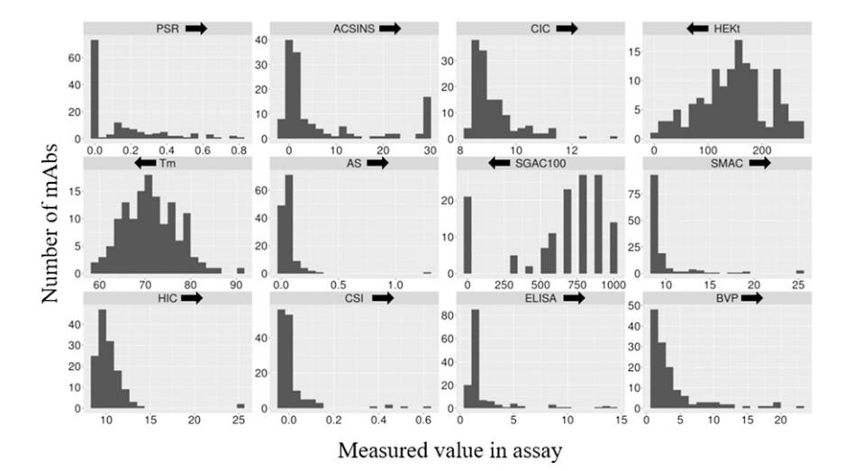
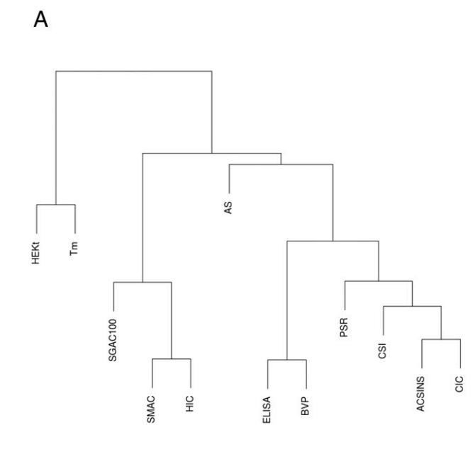
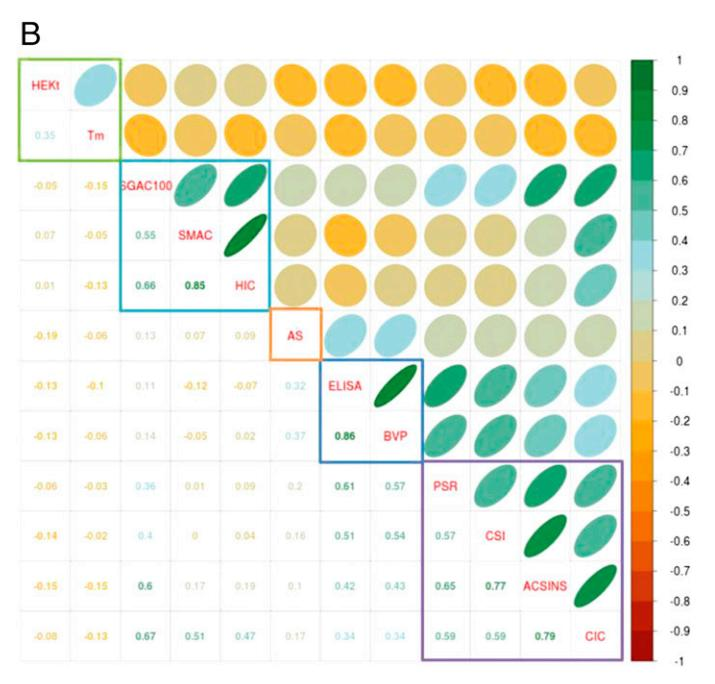
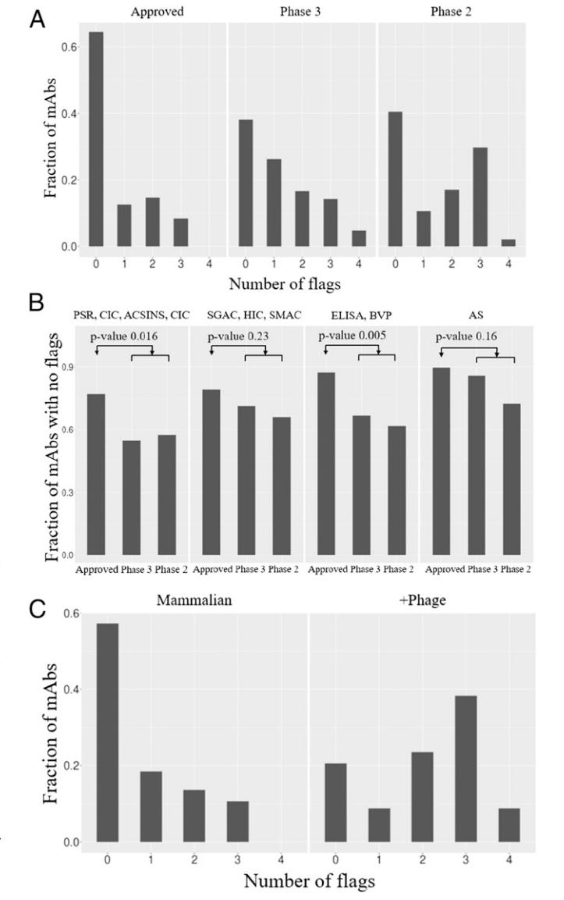
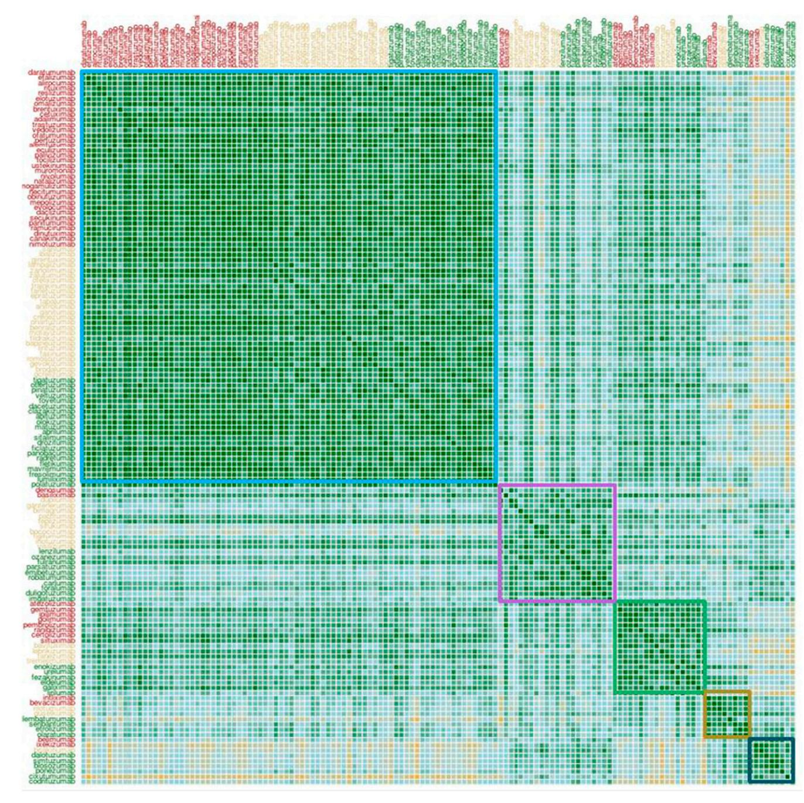

# Biophysical properties of the clinical-stage antibody landscape

Tushar Jaina,1, Tingwan Sunb,1, Stéphanie Durandc , Amy Hallc , Nga Rewa Houstonc,d, Juergen H. Nette , Beth Sharkeye , Beata Bobrowicze , Isabelle Caffryb , Yao Yub , Yuan Caob , Heather Lynaughb , Michael Brownb , Hemanta Baruahd , Laura T. Grayd , Eric M. Kraulandd , Yingda Xub,2, Maximiliano Vásqueza,2, and K. Dane Wittrupa,b,c,d,e,2

a Department of Computational Biology, Adimab LLC, Lebanon, NH 03766; b Department of Protein Analytics, Adimab LLC, Lebanon, NH 03766; c Department of Molecular Biology, Adimab LLC, Lebanon, NH 03766; d Department of Antibody Discovery, Adimab LLC, Lebanon, NH 03766; and e Department of High-Throughput Expression, Adimab LLC, Lebanon, NH 03766

Edited by James A. Wells, University of California, San Francisco, CA, and approved December 13, 2016 (received for review October 2, 2016)

Antibodies are a highly successful class of biological drugs, with over 50 such molecules approved for therapeutic use and hundreds more currently in clinical development. Improvements in technology for the discovery and optimization of high-potency antibodies have greatly increased the chances for finding binding molecules with desired biological properties; however, achieving drug-like properties at the same time is an additional requirement that is receiving increased attention. In this work, we attempt to quantify the historical limits of acceptability for multiple biophysical metrics of "developability." Amino acid sequences from 137 antibodies in advanced clinical stages, including 48 approved for therapeutic use, were collected and used to construct isotypematched IgG1 antibodies, which were then expressed in mammalian cells. The resulting material for each source antibody was evaluated in a dozen biophysical property assays. The distributions of the observed metrics are used to empirically define boundaries of drug-like behavior that can represent practical guidelines for future antibody drug candidates.

monoclonal antibody | developability | biophysical properties | manufacturability | nonspecificity

Target binding is the predominant first concern in development of any drug. However, once a lead molecule attains the desired potency of biological modification, a suite of characteristics termed "developability" assumes critical importance. For monoclonal antibodies, these properties include high-level expression, high solubility, covalent integrity, conformational and colloidal stability, low polyspecificity, and low immunogenicity. The high cost of failing any of these criteria at a late stage in drug development has led to considerable efforts at predicting developability on the basis of sequence motifs and experimentally determined biophysical properties (1–15).

In a landmark study of small-molecule drugs over 2,000 molecules with United States Adopted Names (USAN) designations and known to have oral availability were collected and computationally analyzed (16). A simple set of thresholds, encapsulated as the "Lipinski rule of fives," was formulated and has been used by many to prioritize small molecules for entry into clinical development. To date, analogous guiding principles for antibody drugs have not emerged—we therefore endeavor here to do so. By analogy to the Lipinski effort, we first collected the sequences of antibodies that had reached at least phase-2 trials and had USAN or WHO International Nonproprietary Names (INN) designations (137 in total as of the start of this project). As a common basis for comparison of intrinsic variable domain phenotypes we expressed each antibody as the human IgG1 isotype and formulated them in simple Hepes-buffered saline. Each antibody was then subjected to a battery of 12 different biophysical assays in common use for developability assessment.

Unexpectedly, for many of the measures the distribution of values was not symmetrically Gaussian, but instead was long-tailed, with several antibodies exhibiting values significantly higher (more problematic) than the mean. Because all antibodies in this study have been developed past phase 1, this result suggests that many of the currently available metrics suffer from a propensity for falsely predicting development failure. However, stratifying the dataset according to stage of development reveals that the number of such "red flags" (defined below) decreases for those molecules furthest along in the process, with approved antibodies trending toward fewer warnings.

## Results

Sequence Characteristics of Antibody Drugs. To compare antibody variable domain properties within a common context the chosen set of 137 antibodies was expressed as human IgG1 isotype (allele \*01) with standard constant regions for kappa and lambda (alleles IGKC\*01 and IGLC2\*01, respectively) as appropriate. This necessarily means that the exact isotypes, let alone full chain sequences, of many of these antibodies are different from those of the actual drugs—however, comparisons strictly on the basis of variable domain differences are made possible by this study design. Perfectly replicating biological drug substances is notoriously complex and a field unto itself concerned with this task has emerged, known as biosimilar development. Creating over 130 biosimilars is clearly beyond the intended scope of this work. However, by reporting data for published sequences this study will enable others to replicate the results as well as perform their own sequence/function correlation analyses.

#### Significance

In addition to binding to a desired target molecule, all antibody drugs must also meet a set of criteria regarding the feasibility of their manufacture, stability in storage, and absence of off-target stickiness. This suite of characteristics is often termed "developability." We present here a comprehensive analysis of these properties for essentially the full set of antibody drugs that have been tested in phase-2 or -3 clinical trials, or are approved by the FDA. Surprisingly, many of the drugs or candidates in this set exhibit properties that indicate significant developability risks; however, the number of such red warning flags decreases with advancement toward approval. This reference dataset should help prioritize future drug candidates for development.

Conflict of interest statement: All of the authors are employed by Adimab, LLC, whose business is the discovery of antibody drugs.

This article is a PNAS Direct Submission.

Freely available online through the PNAS open access option.

Author contributions: T.J., E.M.K., Y.X., M.V., and K.D.W. designed research; T.J., T.S., S.D., A.H., N.R.H., J.H.N., B.S., B.B., I.C., Y.Y., Y.C., H.L., M.B., H.B., L.T.G., Y.X., and M.V. performed research; S.D., A.H., N.R.H., J.H.N., B.S., and B.B. contributed new reagents/analytic tools; T.J., T.S., J.H.N., B.S., I.C., Y.Y., Y.C., H.L., M.B., H.B., L.T.G., E.M.K., Y.X., M.V., and K.D.W. analyzed data; and T.J., T.S., J.H.N., E.M.K., Y.X., M.V., and K.D.W. wrote the paper.

1 T.J. and T.S. contributed equally to this work.

2 To whom correspondence may be addressed. Email: [yingda.xu@adimab.com](mailto:yingda.xu@adimab.com), [max.](mailto:max.vasquez@adimab.com) [vasquez@adimab.com,](mailto:max.vasquez@adimab.com) or [dane.wittrup@adimab.com.](mailto:dane.wittrup@adimab.com)

This article contains supporting information online at [www.pnas.org/lookup/suppl/doi:10.](http://www.pnas.org/lookup/suppl/doi:10.1073/pnas.1616408114/-/DCSupplemental) [1073/pnas.1616408114/-/DCSupplemental.](http://www.pnas.org/lookup/suppl/doi:10.1073/pnas.1616408114/-/DCSupplemental)

The antibodies chosen for this study are listed in [Dataset S1;](http://www.pnas.org/lookup/suppl/doi:10.1073/pnas.1616408114/-/DCSupplemental/pnas.1616408114.sd01.xlsx) 48 antibodies were built from variable region sequences found in clinically approved antibodies (two of them approved so far only outside the United States), 42 are in the phase-3 or phase-2/3 stage, and the remaining 47 are in phase 2. A total of 124 have kappa light chains, and 13 are lambdas. Fifty-eight are classified as "fully human" (with -UMAB suffix) and 67 as "humanized" (with –ZUMAB suffix), and 12 have at least one "fully" nonhuman variable region (–XIMAB, –XIZUMAB, or –MONAB suffix). The variable region sequences for these antibodies are presented in [Dataset S2](http://www.pnas.org/lookup/suppl/doi:10.1073/pnas.1616408114/-/DCSupplemental/pnas.1616408114.sd02.xlsx).

Brief Description of Assays. The criteria applied in selecting the suite of assays were twofold. First, a peer-reviewed publication exists of it's being used for therapeutic antibody characterization, or it is a generally used assay (e.g., titers). Second, the assay was amenable to characterizing hundreds of antibodies and consumed <1 mg per assay of material. As such, it is more likely that these or related assays would be used in the early stages of an antibody discovery cascade. Assays performed in this study included assessment of antibody selfinteraction by AC-SINS (affinity-capture self-interaction nanoparticle spectroscopy) (3, 9, 11) and CSI-BLI (clone self-interaction by biolayer interferometry) (7), a variety of metrics of cross-interaction such as binding PSR (poly-specificity reagent) (8), or BVP (baculovirus particle) (4), CIC (cross-interaction chromatography) (1), and classic ELISA with a panel of commonly used antigens (17). Data on expression titer in HEK cells, melting temperature (Tm) of the Fab, hydrophobic interaction chromatography (HIC) and a related assay, SGAC-SINS (salt-gradient affinity-capture self-interaction nanoparticle spectroscopy) were also collected (18), as were data on standup monolayer adsorption chromatography (SMAC) (13). Finally, the percentage of monomeric species assessed by size-exclusion chromatography (SEC) in the context of an accelerated stability (AS) study completes the panel of assays. The experimental measurements obtained for the antibodies used in this study are presented in [Dataset S3](http://www.pnas.org/lookup/suppl/doi:10.1073/pnas.1616408114/-/DCSupplemental/pnas.1616408114.sd03.xlsx).

Biophysical Property Distributions Are Long-Tailed. The distributions of measured values for 12 biophysical measures are presented in Fig. 1. We had assumed a priori that the success of these molecules in overcoming the considerable hurdles of high-level expression, formulation, and acceptable phase-1 clinical trial safety would yield a set of antibodies with uniformly favorable biophysical properties. However, for most of the measures we find this not to be the case, with a small but significant population of molecules exhibiting unusually unfavorable values for one or more measures. An example would be the PSR measurement, high values of which have been shown previously to correlate well with pharmacokinetics (PK) in mice (19, 20). In the earlier work (see, for example, figure 2A of ref. 19), a rough PSR cutoff above which antibodies tended to present faster clearance in mice was observed; when converted to the scaled values used in the present study, the cutoff is around 0.25. It is thus interesting that 33 of the 137 antibodies in the examined set have PSR values above this previously established cutoff. Such non-FcRn-, non-target-mediated systemic clearance is likely due to simple stickiness in disseminated tissues (19, 21, 22). It is therefore surprising that 24% of these antibodies, which have reached at least phase-2 stage, exhibit such high values for this nonspecific stickiness criterion. One possibility is that the actual drug substance exhibits different properties due to its particular expression, purification, formulation, or non-IgG1 isotype (11 of the 29 have IgG2 or IgG4 isotypes). To test this hypothesis, we measured the full biophysical property set of nine vialed monoclonal antibody drugs and found that, for the most part, the numerical values for these measures are not significantly different from those assessed with our preparations [\(Table S1\)](http://www.pnas.org/lookup/suppl/doi:10.1073/pnas.1616408114/-/DCSupplemental/pnas.201616408SI.pdf?targetid=nameddest=ST1); the respective PSR values show a linear correlation, r2 , of 0.99.

The evidence is definitive that some unfavorable values within the ranges observed do not represent an insurmountable obstacle for ultimately successful clinical development of a given molecule. However, it would be difficult to argue that unfavorable values for any of these measures could not present at least some difficulties for successful drug development. Perhaps the flaws indicated by these attributes were overcome through creative and/or exhaustive efforts in cell-line development, cell-culture optimization, and formulation to result in a vialed drug that meets minimum standards for advancement. However, of course the impact of such fixes ends at the moment of parenteral administration, at which point negative impact on drug pharmacokinetics might result in negative clinical trial outcomes [see, for a possible example, the case of briakinumab vs. ustekinumab (20, 23)]. Intravenous administration, which still dominates the approved set, is less demanding of high concentrations and thus may be more tolerant of suboptimal aggregation behavior. Also, target-mediated clearance, a more "intrinsic" feature of the biology of the molecule, may dominate overall PK in patients.

Clustering of Biophysical Property Values. It is likely that there is considerable redundancy in the information obtainable from the dozen measurements presented here. To examine this possibility, we performed an unsupervised clustering of the data and obtained

Fig. 1. Histograms of 12 different biophysical assay values for 137 monoclonal antibodies in commercial clinical development. An arrow above each panel indicates the direction of unfavorable values (e.g., higher PSR is unfavorable, because it indicates greater nonspecific binding activity by the antibody assayed.) Most of the distributions are asymmetrically long-tailed in the unfavorable direction.

Fig. 2. (A) Hierarchical clustering of biophysical properties. (B) Matrix and clustering representation of biophysical properties. The lower triangle shows Spearman correlation coefficients, and the upper triangle shows a graphic representation of the same correlation values. The values for SGAC100 were negated before calculating the clustering and correlation coefficients, because its direction of favorability is opposite to HIC and SMAC. The eccentricity of the ellipses is proportional to the magnitude of the correlation coefficient. The slope of the major axis has the same sign as the correlation coefficient.

the clusters shown in Fig. 2A. The Spearman rank order correlation of each pair of measures is presented graphically in Fig. 2B. Based on this analysis we have chosen five such clusters for further examination: (PSR, CSI, AC-SINS, CIC), (SGAC100, SMAC, HIC), (ELISA, BVP), (AS), and (HEK titer, Tm). On first inspection, it may be surprising to find the biological parameter of cell culture expression titer correlating most closely with the thermodynamic state variable of Tm. However, in fact this same correlation has been observed previously for secretion in yeast (24, 25) and mammalian cells (26). It should be noted that the titers obtained from transient HEK expression may not closely reflect productivity in optimized cell lines by stable transfection of typical production host cells such as CHO or murine myeloma lines. The assumption here is that for most cases, nevertheless, HEK transition titers are capturing intrinsic, sequence-dependent properties of an antibody that make it more likely that it will express in high levels. The observed correlation to Tm, consistent with literature precedent, supports the notion that this assumption is reasonable. A cluster is observed among SGAC100 (18), SMAC (13), and HIC, which are assays that measure the tendency of antibodies to either self-associate, or associate with a column matrix, under salt-stress conditions. The multiantigen nonspecificity ELISAs closely correlated with

BVP assays that use the same ELISA plate readout—indicating a potential common plate-binding aspect to these assays. With respect to the largest cluster of (PSR, CSI, AC-SINS, CIC), we had a priori expected PSR and CIC to cluster together as measures of cross-interaction, and CSI and AC-SINS to cluster together as self-interaction measures. Because this was not the case, it can be inferred that this group of protein-binding assays measures a common property that differs to some extent from thermodynamic stability (HEK titer, Tm), hydrophobic interaction (SGAC100, SMAC, HIC), long-term aggregation propensity (AS), or ELISA plate binding (ELISA, BVP). It is unexpected that an AS did not quantitatively correlate closely with any of the other four groupings, although the limited dynamic range in the data for these largely well-behaved molecules limits the ability to explore correlation to other assays. Nonetheless, 19/24 of the antibodies with an AS result outside the acceptable range (discussed below) also had at least one out-of-range value within the (PSR, CSI, AC-SINS, CIC) and (SGAC100, SMAC, HIC) sets.

Threshold Warning Flag Approach. To reconcile these assays' discovery of purported developability defects with the success of these antibodies' progression into clinical trials, we reframed the existence

Table 1. Thresholds of biophysical properties derived from analysis on samples corresponding to the 48 approved antibodies

| Group   | Assay     | Worst 10% threshold | Units (flag)                        |
|---------|-----------|---------------------|-------------------------------------|
| Group 1 | PSR       | 0.27 ± 0.06         | None (>)                            |
|         | ACSINS    | 11.8 ± 6.2          | Nanometers (wavelength change) (>)  |
|         | CSI       | 0.01 ± 0.02         | BLI response units (>)              |
|         | CIC       | 10.1 ± 0.5          | Retention time (min) (>)            |
| Group 2 | HIC       | 11.7 ± 0.6          | Retention time (min) (>)            |
|         | SMAC      | 12.8 ± 1.2          | Retention time (min) (>)            |
|         | SGAC-SINS | 370 ± 133           | Salt concentration (mM) (<)         |
| Group 3 | BVP       | 4.3 ± 2.2           | Fold-over-background (>)            |
|         | ELISA     | 1.9 ± 1.0           | Fold-over-background (>)            |
| Group 4 | AS        | 0.08 ± 0.03         | Monomer percentage loss per day (>) |

of high values for any of the measures in a given cluster simply as a "red flag," indicating the potential presence of problems that perhaps had been resolved during bioprocess and formulation development. In keeping with the threshold used by Lipinski et al. (16), we chose the cutoff of 10% worst values among approved drugs as a threshold for a warning flag (Table 1). When antibodies at different stages of development were examined for the number of warning flags there was a progressive decrease in warning flags with advancement (Fig. 3A). Approved drugs had the fewest flags, with 65% (31) possessing no flags at all. By contrast, that number dropped to 40% (19) for the antibodies still being tested in phase-2 clinical trials, and nearly 32% (15) had over two warning flags in the developability assays. Examination of the trend in Fig. 3A gives the impression that lower warning flags correspond to higher probability of clinical trial advancement; however, of course phase-2 and -3 trials evaluate therapeutic efficacy rather than the abstract biophysical properties measured in these developability assays. The statistical significance of the results is further detailed in Fig. 3B, where distinct distributions between the approved set and the rest are demonstrated for the (PSR, CSI, ACSINS, CIC) and (ELISA, BVP) groups of assays. It is possible that excessive promiscuous antibody interactions previously shown to correlate with accelerated systemic clearance (4, 19, 21, 22) also limit efficacy by decreasing the amount of drug on target. In fact, an analogous trend has been consistently observed for small-molecule drugs, whereby lipophilicity and molecular weight decrease with clinical advancement (27, 28), a trend also attributed in part to affect relative drug levels on target. The Tm was not considered for the above analysis because the values were close to normally distributed and within an acceptable range for development. Additionally, we also excluded the titer measurements from transient HEK expression, because these measurements may not reflect production in stable mammalian cell lines, as discussed earlier. In addition, the distribution of boundary violation counts using only antibodies known to have been developed as IgG1 (77 of the 137) looks like the distribution obtained with the entire set [\(Fig. S1\)](http://www.pnas.org/lookup/suppl/doi:10.1073/pnas.1616408114/-/DCSupplemental/pnas.201616408SI.pdf?targetid=nameddest=SF1), suggesting that isotype differences are not a dominant factor to these results.

It has been noted previously that antibodies discovered via phage display of fragments can display unfavorable biophysical characteristics relative to antibodies cloned from immunized mice (26, 29). Examination of the provenance of the antibodies in our dataset is consistent with this observation (Fig. 3C), in that the number of flags for antibodies engineered at some point by phage display are significantly higher than those derived from mammalian sources.

Antibody Clustering by Property Set. To investigate whether the antibodies would partition into distinct sets based on measurements in the selected assays we performed hierarchical clustering on the dataset. The calculation of pairwise distances between antibodies using the vector of biophysical properties is detailed in [Supporting In](http://www.pnas.org/lookup/suppl/doi:10.1073/pnas.1616408114/-/DCSupplemental/pnas.201616408SI.pdf?targetid=nameddest=STXT)[formation](http://www.pnas.org/lookup/suppl/doi:10.1073/pnas.1616408114/-/DCSupplemental/pnas.201616408SI.pdf?targetid=nameddest=STXT). The result of these calculations is shown in Fig. 4, where we have overlaid rectangles corresponding to five observed distinct clusters. The two largest clusters consisted of 80 and 22 antibodies, respectively. The largest cluster exhibited more generally favorable biophysical properties as evidenced by the distribution of red flags shown in [Fig. S2](http://www.pnas.org/lookup/suppl/doi:10.1073/pnas.1616408114/-/DCSupplemental/pnas.201616408SI.pdf?targetid=nameddest=SF2). This "clean" cluster includes 34 of the 48 approved antibodies in our dataset, indicating that the general property of exhibiting one or fewer red flags is associated with clinical success. The second-largest cluster was composed predominantly of phase-2 and phase-3 antibodies. The distribution of assay measurements for each cluster is shown in [Fig. S3](http://www.pnas.org/lookup/suppl/doi:10.1073/pnas.1616408114/-/DCSupplemental/pnas.201616408SI.pdf?targetid=nameddest=SF3). The clustering was robust to a change in the parameters used for the calculation of pairwise distances [\(Fig. S4](http://www.pnas.org/lookup/suppl/doi:10.1073/pnas.1616408114/-/DCSupplemental/pnas.201616408SI.pdf?targetid=nameddest=SF4)).

### Discussion

In earlier publications from our laboratories we had described and emphasized the importance of a subset of high-throughput assays applicable to very large numbers of candidate antibodies (7, 8, 11, 18, 19). It is thus both practical and instructive to see how these assays, in particular, delineate the space of antibody drugs actually in clinical development. A natural application of

Fig. 3. (A) Histogram showing number of flags as a function of antibody status in the clinic. For each antibody, a cluster of biophysical properties contributes a value of one to the number of flags if any constituent assay exceeds the thresholds listed in Table 1. (B) Statistical significance analysis of flags per cluster of biophysical properties as a function of clinical progression. (C) Histogram showing number of flags as a function of origin of antibody; +Phage indicates antibodies discovered directly or assisted by phage selection or screening.

the main results in this paper would be a prescription, analogous to Lipinski's rule of fives, to filter or at least rank-order a set of candidates for possible development as therapeutics.

A consequence of the increased pace of development of antibody therapeutics has been the establishment of so-called platform approaches for process development and formulation (30, 31). Particularly favorable developability profiles for a given candidate are more likely to fit within the constraints of given platforms (30). Conversely, and in the best-case scenario, molecules with characteristics outside what is typically favorable are likely to require additional resources for establishment of successful process development and formulation. How the cutoffs defined in this work may relate to the features of specific development platforms is the subject of ongoing research. A closely related point is how establishment of early-stage developability assessment may affect the ultimate success rate of antibodies in the clinic (of course, related to factors distinct from the biomedical

Fig. 4. Clustering of antibodies based on biophysical properties. The rectangles are ordered by decreasing cluster size. The approved, phase-3, and phase-2 antibodies are shown in red, brown, and green, respectively. The colors in the clustering matrix follow the same scale as in Fig. 2B.

hypothesis a given drug is testing). Judging from the literature discussion on developability, one can estimate that these concepts may have begun to become prevalent around 2010 or later (1). Because our set of antibodies have started at least phase-2 clinical trials, it follows that the clear majority, if not all, of them started development before 2010 (for example, the associated patent priority dates on the sequences of the antibodies in this study are all before midyear of 2009).

A key goal of this work was to establish cutoffs for acceptable values of each of the assays performed, derived from the antibody drug space defined here. However, we were surprised to find values asymmetrically far into the undesirable tail of the histogram for many antibodies seemingly advancing successfully through clinical trials. Although we cannot rule out that some of these poor properties may be attributable to isotype differences with the actual drug product, or particulars of expression, purification, and formulation, we found that formulated drug versions of several of these antibodies gave values very similar to those of the preparations we tested ([Table S1\)](http://www.pnas.org/lookup/suppl/doi:10.1073/pnas.1616408114/-/DCSupplemental/pnas.201616408SI.pdf?targetid=nameddest=ST1). Despite these exceptions, it is clear that the great majority of approved antibodies cluster within a priori favorable ranges of parameter space. We have used 90th percentiles in these metrics, using this subset of the data, to define a zone of most favorable properties. This is analogous to the original Lipinski work where reasonable boundaries were likewise drawn (16). Although the choice of a given percentile cutoff value is arbitrary, it is noteworthy that unsupervised hierarchical clustering also reveals natural groupings into "clean" and "less-clean" subsets (Fig. 4). As observed in Fig. 3A, the number of drug boundary violations exhibited by a given IgG tends to decrease with the stage of clinical advance of the corresponding drug (from which variable region sequences were obtained).

Because no single unfavorable assay we examined definitively predicted failure to advance to at least phase-2 clinical trials, a more holistic approach of weighted consideration of multiple biophysical properties is necessary. The practical problem faced by an antibody drug developer can be broken down to two parts: (i) which from among a small set of lead antibody molecules exhibiting similar bioactivity is the one predicted to be most likely to successfully navigate the subsequent development process and (ii) whether any danger signals apparent for that lead molecule are sufficiently menacing to necessitate further protein engineering or formulation efforts before advancing the program. We propose that weighted consideration of about a dozen biophysical assays with complementary and overlapping characteristics, such as those reported here, can be a useful tool for making these decisions.

#### Materials and Methods

Curated Set of Antibodies. For antibodies, and biologicals in general, unlike for small molecules, full disclosure of chemical structure (amino acid sequence) did not become a requirement for attaining INN before 2006; thus, many antibody molecules that entered development in the early time frame do not have an "official" source for sequence information. Nonetheless, based on analysis of peer-reviewed and patent literature, a number of sequences for those antibodies were likewise collected. Details of the process including sources for all of the sequence information are included in [Supporting Information](http://www.pnas.org/lookup/suppl/doi:10.1073/pnas.1616408114/-/DCSupplemental/pnas.201616408SI.pdf?targetid=nameddest=STXT).

Antibody Expression, Production, and Purification. The 137 antibodies were expressed in HEK293 cells. The VH and VL encoding gene fragments (Integrated DNA Technologies) were subcloned into heavy- and light-chain pcDNA 3.4+ vectors (ThermoFisher). The variable region sequences are listed in [Dataset S2](http://www.pnas.org/lookup/suppl/doi:10.1073/pnas.1616408114/-/DCSupplemental/pnas.1616408114.sd02.xlsx). All mAbs were expressed as IgG1 isotype. The corresponding vectors were cotransfected into HEK293 suspension cells. After 6 d of growth, the cell culture supernatant was harvested by centrifugation and passed over Protein A agarose (MabSelect SuRe; GE Healthcare Life Sciences). The bound antibodies were then washed with PBS and eluted with buffer (200 mM acetic acid/50 mM NaCl, pH 3.5) into 1/8 volume

- 1. Jacobs SA, Wu SJ, Feng Y, Bethea D, O'Neil KT (2010) Cross-interaction chromatography: A rapid method to identify highly soluble monoclonal antibody candidates. Pharm Res 27(1):65–71.
- 2. Nishi H, et al. (2011) Fc domain mediated self-association of an IgG1 monoclonal antibody under a low ionic strength condition. J Biosci Bioeng 112(4):326–332.
- 3. Sule SV, et al. (2011) High-throughput analysis of concentration-dependent antibody self-association. Biophys J 101(7):1749–1757.
- 4. Hötzel I, et al. (2012) A strategy for risk mitigation of antibodies with fast clearance. MAbs 4(6):753–760.
- 5. Lauer TM, et al. (2012) Developability index: A rapid in silico tool for the screening of antibody aggregation propensity. J Pharm Sci 101(1):102–115.
- 6. Sule SV, Dickinson CD, Lu J, Chow CK, Tessier PM (2013) Rapid analysis of antibody selfassociation in complex mixtures using immunogold conjugates. Mol Pharm 10(4):1322–1331.
- 7. Sun T, et al. (2013) High throughput detection of antibody self-interaction by biolayer interferometry. MAbs 5(6):838–841.
- 8. Xu Y, et al. (2013) Addressing polyspecificity of antibodies selected from an in vitro yeast presentation system: A FACS-based, high-throughput selection and analytical tool. Protein Eng Des Sel 26(10):663–670.
- 9. Geng SB, Cheung JK, Narasimhan C, Shameem M, Tessier PM (2014) Improving monoclonal antibody selection and engineering using measurements of colloidal protein interactions. J Pharm Sci 103(11):3356–3363.
- 10. Jayaraman J, et al. (2014) Plasmonic measurements of monoclonal antibody self-association using self-interaction nanoparticle spectroscopy. Biotechnol Bioeng 111(8):1513–1520.
- 11. Liu Y, et al. (2014) High-throughput screening for developability during early-stage antibody discovery using self-interaction nanoparticle spectroscopy. MAbs 6(2):483–492.
- 12. Jarasch A, et al. (2015) Developability assessment during the selection of novel therapeutic antibodies. J Pharm Sci 104(6):1885–1898.
- 13. Kohli N, et al. (2015) A novel screening method to assess developability of antibodylike molecules. MAbs 7(4):752–758.
- 14. Obrezanova O, et al. (2015) Aggregation risk prediction for antibodies and its application to biotherapeutic development. MAbs 7(2):352–363.
- 15. Sharma VK, et al. (2014) In silico selection of therapeutic antibodies for development: Viscosity, clearance, and chemical stability. Proc Natl Acad Sci USA 111(52):18601–18606.
- 16. Lipinski CA, Lombardo F, Dominy BW, Feeney PJ (2001) Experimental and computational approaches to estimate solubility and permeability in drug discovery and development settings. Adv Drug Deliv Rev 46(1-3):3–26.
- 17. Mouquet H, et al. (2010) Polyreactivity increases the apparent affinity of anti-HIV antibodies by heteroligation. Nature 467(7315):591–595.

2 M Hepes, pH 8.0. The final products were buffer-exchanged into 25 mM Hepes and 150 mM sodium chloride, pH 7.3.

Approved Antibody Drugs. The antibody drugs Remicade, Simponi, Keytruda, Entyvio, Mabthera, Humira, Xgeva, Yervoy, and Avastin (corresponding to infliximab, golimumab, pembrolizumab, vedolizumab, rituximab, adalimumab, denosumab, ipilimumab, and bevacizumab, respectively) were ordered from [myoderm.com](http://myoderm.com). All of these clinical samples were diluted down to 1 mg/mL with corresponding assay buffers before analysis. All samples were analyzed by reducing liquid chromatography-MS to confirm sequence match to both light chain and heavy chain after consideration of any differences in the constant regions [\(Dataset S3\)](http://www.pnas.org/lookup/suppl/doi:10.1073/pnas.1616408114/-/DCSupplemental/pnas.1616408114.sd03.xlsx).

Biophysical Measurements. Protocol details for CIC, PSR binding assay, CSI-BLI, AC-SINS, SGAC-SINS, Tm using differential scanning fluorescence (DSF), SMAC, accelerated stability SEC slope, HIC, BVP assay, and ELISA are all provided in [Supporting Information](http://www.pnas.org/lookup/suppl/doi:10.1073/pnas.1616408114/-/DCSupplemental/pnas.201616408SI.pdf?targetid=nameddest=STXT).

Statistical Analysis. All statistical analysis was completed with the assistance of R version 3.2.4. Although many metrics such as Tm and HIC seemed to show normal or log-normal distributions, there were many that did not, precluding the use of Pearson's correlations to analyze the full dataset. As such, Spearman's rank correlations were calculated for all pairwise combinations of antibody characteristics. Therefore, one can only conclude correlation between relative rankings on the assays, but not directly between the assays themselves. To assess statistical significance of correlations, an exact P value was calculated for each pairwise comparison. Two-by-two contingency tables were constructed for approval status vs. presence of flags within each group of assays. Fisher's exact tests for count data were performed on these contingency tables and an exact P value (Fig. 3B) was calculated for the null hypothesis that the true odds ratio is unity. Additionally, an identical analysis was carried out for each assay individually, and the results are summarized in [Table S2.](http://www.pnas.org/lookup/suppl/doi:10.1073/pnas.1616408114/-/DCSupplemental/pnas.201616408SI.pdf?targetid=nameddest=ST2) To further assess whether the distributions of the assay measurements differed between the approved and nonapproved antibodies, the two-sample Anderson–Darling (33) test was performed. [Table S3](http://www.pnas.org/lookup/suppl/doi:10.1073/pnas.1616408114/-/DCSupplemental/pnas.201616408SI.pdf?targetid=nameddest=ST3) lists the P values for rejecting the null hypothesis that the measurements arise from a common underlying distribution. The error bars in Table 1 and [Fig. S5](http://www.pnas.org/lookup/suppl/doi:10.1073/pnas.1616408114/-/DCSupplemental/pnas.201616408SI.pdf?targetid=nameddest=SF5) were estimated using bootstrapping as implemented in the package boot.

ACKNOWLEDGMENTS. We thank other Adimab LLC staff members for their many contributions.

- 18. Estep P, et al. (2015) An alternative assay to hydrophobic interaction chromatography for high-throughput characterization of monoclonal antibodies. MAbs 7(3):553–561.
- 19. Kelly RL, et al. (2015) High throughput cross-interaction measures for human IgG1 antibodies correlate with clearance rates in mice. MAbs 7(4):770–777.
- 20. Kelly RL, et al. (2016) Target-independent variable region mediated effects on antibody clearance can be FcRn independent. MAbs 8(7):1269–1275.
- 21. Datta-Mannan A, et al. (2015) The interplay of non-specific binding, target-mediated clearance and FcRn interactions on the pharmacokinetics of humanized antibodies. MAbs 7(6):1084–1093.
- 22. Sigounas G, Harindranath N, Donadel G, Notkins AL (1994) Half-life of polyreactive antibodies. J Clin Immunol 14(2):134–140.
- 23. Schoch A, et al. (2015) Charge-mediated influence of the antibody variable domain on FcRn-dependent pharmacokinetics. Proc Natl Acad Sci USA 112(19):5997–6002.
- 24. Kowalski JM, Parekh RN, Mao J, Wittrup KD (1998) Protein folding stability can determine the efficiency of escape from endoplasmic reticulum quality control. J Biol Chem 273(31): 19453–19458.
- 25. Kowalski JM, Parekh RN, Wittrup KD (1998) Secretion efficiency in Saccharomyces cerevisiae of bovine pancreatic trypsin inhibitor mutants lacking disulfide bonds is correlated with thermodynamic stability. Biochemistry 37(5):1264–1273.
- 26. Wang F, et al. (2013) Somatic hypermutation maintains antibody thermodynamic stability during affinity maturation. Proc Natl Acad Sci USA 110(11):4261–4266.
- 27. Leeson PD, Springthorpe B (2007) The influence of drug-like concepts on decisionmaking in medicinal chemistry. Nat Rev Drug Discov 6(11):881–890.
- 28. Waring MJ, et al. (2015) An analysis of the attrition of drug candidates from four major pharmaceutical companies. Nat Rev Drug Discov 14(7):475–486.
- 29. Spencer S, Bethea D, Raju TS, Giles-Komar J, Feng Y (2012) Solubility evaluation of murine hybridoma antibodies. MAbs 4(3):319–325.
- 30. Hartmann S, Kocher HP (2016) Best practices in assessment of developability of biopharmaceutical candidates. Developability of Biotherapeutics: Computational Approaches, eds Kumar S, Singh SK (CRC, Boca Raton, FL), pp 155–174.
- 31. Warne NW (2011) Development of high concentration protein biopharmaceuticals: The use of platform approaches in formulation development. Eur J Pharm Biopharm 78(2): 208–212.
- 32. He F, Woods CE, Becker GW, Narhi LO, Razinkov VI (2011) High-throughput assessment of thermal and colloidal stability parameters for monoclonal antibody formulations. J Pharm Sci 100(12):5126–5141.
- 33. Anderson TW, Darling DA (1952) Asymptotic theory of certain "goodness of fit" criteria based on stochastic processes. Ann Math Stat 23(2):193–212.

Downloaded from https://www.pnas.org by 71.255.54.11 on October 31, 2025 from IP address 71.255.54.11.