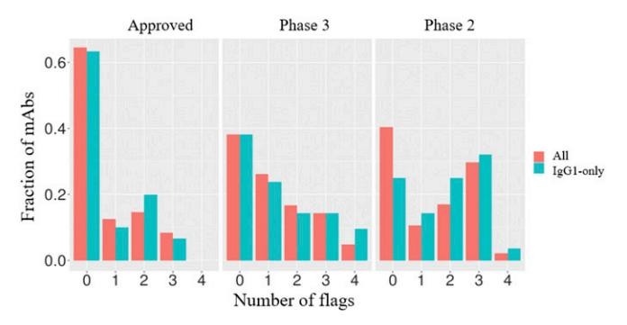
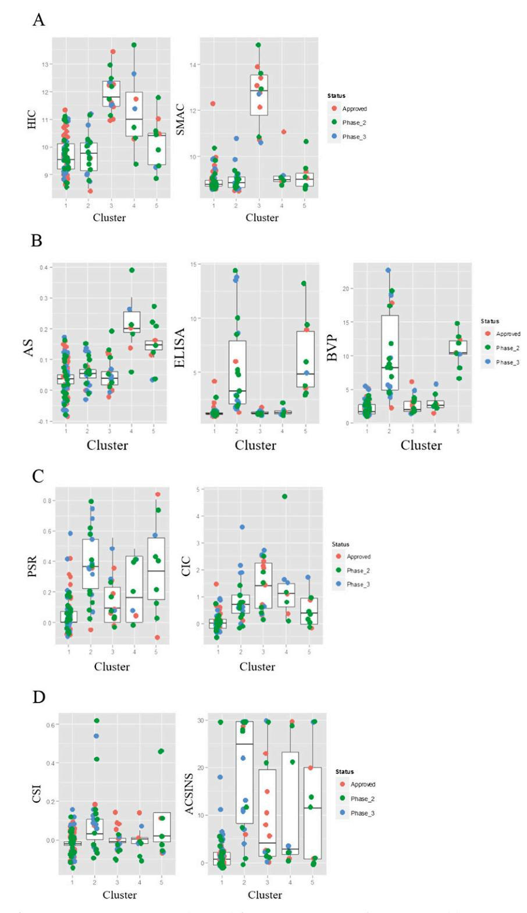
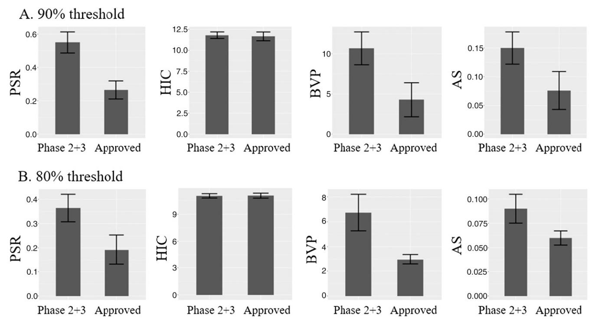

# Supporting Information

## Jain et al. 10.1073/pnas.1616408114

## CIC

CIC was performed as described previously (1). In brief, the CIC column was prepared by coupling ∼30 mg of human serum polyclonal antibodies (I4506; Sigma) to a 1-mL HiTrap column (17-0716-01; GE Healthcare), followed by quenching with ethanolamine. Approximately 5 μg of each antibody was tested at a flow rate of 0.1 mL/min using PBS as a mobile phase on an Agilent 1100 series HPLC system.

### PSR Binding Assay

The PSR assay was done as previously described (8). In short, soluble membrane proteins were prepared from CHO cells. The enriched membrane fraction was biotinylated using NHS-LC-Biotin (Pierce, 21336; Thermo Fisher). This polyspecificity reagent was incubated with IgG-presenting yeast, followed by washing. Then secondary labeling mix (Extravidin-R-PE, antihuman LC-FITC, and propidium iodide) was added to the mixture. Samples were analyzed on FACSCanto (BD Biosciences) using an HTS sample injector. Flow cytometry data were analyzed for median fluorescence intensity (MFI) in the R-PE channel to assess nonspecific binding. MFI values were normalized from 0 to 1 based on three reference antibodies exhibiting low, medium, and high PSR MFI values.

### CSI-BLI

The CSI-BLI assay was carried out as previous described (7). Briefly, human IgG was loaded to an AHQ biosensor (ForteBio) to ∼1 nm, followed by sensor blocking with human IgG1 Fc. The self-association was performed at 1 μM solution concentration of IgG for 300 s on an Octet HTX system (ForteBio). The binding response from the association step was subtracted from that of a reference IgG (adalimumab).

### AC-SINS

The AC-SINS assay was performed as described previously (3, 11). In short, gold nanoparticles (15705; Ted Pella Inc.) were coated with 80% capturing anti-human goat IgG Fc (109-005-098; Jackson ImmunoResearch) and 20% with polyclonal goat nonspecific antibody (005-000-003; Jackson ImmunoResearch). The antibodies of interest were then incubated with the particles for 2 h and the wavelength shift was measured using Molecular Devices SpectraMax M2 with SoftMax Pro6 software. The self-interacting clones show a higher wavelength shift away from the PBS sample.

### SGAC-SINS

The SGAC-SINS assay was performed as described previously (18). In short, gold nanoparticles (15705; Ted Pella Inc.) were coated with 80% capturing anti-human goat IgG Fc (109-005-098; Jackson ImmunoResearch) and 20% with polyclonal goat nonspecific antibody (005-000-003; Jackson ImmunoResearch). The antibodies of interest were then incubated with the particles for 30 min. The samples were then diluted with varying ranges of ammonium sulfate (300–1,000 mM in 100-mM steps) and incubated for an additional 1.5 h. The wavelength shift was measured using Molecular Devices SpectraMax M2 with SoftMax Pro6 software. The SGAC100 was obtained by graphing the wavelength shifts of a sample against the ammonium sulfate concentration and extrapolating the concentration at which the shift was 560 nm. For antibodies where the shift was below 560 nm at the highest salt concentration a value of 1,000 mM was assigned.

#### Tm Using DSF

The Tm was determined using a CFX96 Real-Time System from BioRad, based on the protocol described earlier (32). Briefly, 20 μL of 1 mg/mL sample was mixed with 10 μL of 20× SYPRO orange. The plate was scanned from 40 °C to 95 °C at a rate of 0.5 °C/2 min. The Fab Tm was assigned using the first derivative of the raw data from the BioRad analysis software.

## SMAC

The SMAC assay was performed as described previously (13). Briefly, 2 μg of samples were injected into a Zenix SEC-300 column (213300-4630; Sepax Technologies). A flow rate of 0.35 mL/min with the running buffer containing 150 mM sodium phosphate at pH 7.0 was used. Retention time for each sample was assigned based on the major peak.

### AS SEC Slope

Samples were kept 1 mg/mL at 40 °C for 30 d in HBS (25 mM Hepes and 150 mM sodium chloride, pH 7.3). Time points were taken at day 0, 5, 20, and 30, and the samples were then analyzed by SEC (0022855; Tosoh Bioscience). For SEC analysis, the running buffer composition was 200 mM sodium phosphate and 250 mM sodium chloride, pH 7.0. A long-term stability slope was calculated from the percent aggregated, measured on the SEC.

## HIC

The methodology for this assay was described previously (18). In brief, 5 μg IgG samples (1 mg/mL) were spiked in with a mobile phase A solution (1.8 M ammonium sulfate and 0.1 M sodium phosphate at pH 6.5) to achieve a final ammonium sulfate concentration of about 1 M before analysis. A Sepax Proteomix HIC butyl-NP5 column was used with a liner gradient of mobile phase A and mobile phase B solution (0.1 M sodium phosphate, pH 6.5) over 20 min at a flow rate of 1 mL/min with UV absorbance monitoring at 280 nm.

### BVP Assay

The method used was adopted from Hötzel et al. (4). Briefly, 50 μL baculovirus particles (BlueSky Biotech) stock was diluted with equal volume of 50 mM sodium carbonate (pH 9.6) per well and incubated on ELISA plates (3369; Corning) at 4 °C overnight. The next day, unbound BVPs were aspirated from the wells. All remaining steps were performed at room temperature. One hundred microliters of blocking buffer (PBS with 0.5% BSA) was added and let incubate for 1 h before three washes with 100 μL of PBS. Next, 50 μL of 1 μM testing antibodies in blocking buffer was added to the wells and incubated for 1 h followed by six washes with 100 μL of PBS. Fifty microliters of diluted anti-human IgG-HRP conjugate (81-7120; ZyMax) was added to the wells and incubated for 1 h followed by six washes as before. Finally, 50 μL of TMB substrate (34021; Fisher Scientific) was added to each well and incubated for 10–15 min. The reactions were stopped by adding 50 μL of 2 M sulfuric acid to each well. The absorbance was read at 450 nm and BVP score determined by normalizing absorbance by control wells with no test antibody.

### ELISA

The ELISA protocol we used followed previously established procedures (17). In brief, six different antigens, cardiolipin (50 μg/mL, C0563; Sigma), KLH (5 μg/mL, H8283; Sigma), LPS (10 μg/mL, tlrl-eblps; InvivoGen), ssDNA (1 μg/mL, D8899; Sigma), dsDNA (1 μg/mL, D4522; Sigma), and insulin (5 μg/mL, I9278; Sigma), were coated onto ELISA plates (3369; Corning) individually at 50 μL per well overnight at 4 °C. Plates were blocked with PBS with 0.5% BSA at room temperature (RT) for 1 h, followed by three washes with PBST (PBS plus 0.1% Tween 20). Fifty microliters of 100 nM testing antibody solution was added to each well and incubated at RT for 1 h. The rest of the steps followed the same procedures as in the BVP assay described above.

Antibody Clustering by Property Set. The clustering of antibodies by the properties measured in the assays requires the calculation of a distance between each pair of antibodies. Because the measurements in each assay are on different scales, we used the following scaling procedure for each assay:

$$
\hat{y} = \frac{y - Y_{50\%}}{Y_{80\%} - Y_{20\%}},
$$
 [S1]

where ^yis the scaled value, yis the measurement in the assay, and Y50%, Y80%, Y20% are the median, 80th percentile, and 20th percentile over the 137 antibodies, respectively. Additionally, because the assays can exhibit long-tailed distributions that can skew the pairwise distance computation, we instituted upper and lower bounds for ^y at ±2 scaled units.

Following the calculation of the scaled values, the pairwise distances were calculated such that each group of assays, (PSR, CSI, AC-SINS, CIC), (SGAC100, SMAC, HIC), (ELISA, BVP), and (AS), contributed a single value to the final distance. For example, in the case of the (PSR, CSI, AC-SINS, CIC) assay group,

$$
d_{Gp1} = mean \left(\hat{y}_{PSR}^A - \hat{y}_{PSR}^B, \ \hat{y}_{ACSINS}^A - \hat{y}_{ACSINS}^B, \ \hat{y}_{CIC}^A - \hat{y}_{CIC}^B, \ \hat{y}_{CSI}^A - \hat{y}_{CSI}^B\right).
$$

The final pairwise distance was calculated as

$$
d^{AB} = \frac{\sqrt{d_{Gpp1}^2 + d_{Gpp2}^2 + d_{Gpp3}^2 + d_{Gpp4}^2}}{4}.
$$

The pairwise distance matrix calculated in the above manner was used as an input to hierarchical clustering with an average linkage criterion used for merging clusters. The function hclust in package:stats in R 3.2.4 was used to perform the clustering.

To assess the robustness of the clustering procedure we varied the percentile cutoffs used in the denominator in Eq. S1 to Y75% and Y25% and increased the bounds for ^y to ±3 scaled units. On repeating the clustering with these changes we did not observe materially different clusters emerge compared with the original procedure. The largest cluster contained a majority of the Approved antibodies and the second-largest cluster was dominated by phase-2 and phase-3 antibodies. The results are shown in Fig. S4.

Further Details on the BVP Assay. The BVP score reported here is slightly different from the original method (4). In the earlier work, the BVP score was calculated as the ratio of signal from testing antibody binding to ELISA plate with vs. without BVP. This way, a higher BVP score is only connected to antibodies binding to the BVP, not to the ELISA plate or blocking material, such as BSA. We used a different approach to define background, measuring the signal when the plate was coated with BVP, but no testing antibody was added. This way, molecules that exhibit binding to the ELISA plate or BSA would generate a measurable signal. We considered nontarget binding behavior an undesirable property for the drug candidate. However, this could represent an overstringent criterion because the ELISA plate may represent an artificial surface that an antibody drug may never encounter during its "life cycle."

Fig. S1. Histogram showing number of flags as a function of antibody status in the clinic for the entire set of 137 and for the 77 IgG1 subset.

Fig. S2. Histogram of number of flags as a function of antibody clusters.

Fig. S3. (A) Comparison of HIC and SMAC retention time (minutes) for antibody clusters defined in Fig. 4. (B) Comparison of AS, ELISA, and BVP for antibody clusters. (C) Comparison of PSR and CIC retention times for antibody clusters. (D) Comparison of CSI-BLI responses and AC-SINS wavelength shifts for antibody clusters.

Fig. S4. Clustering of antibodies using an alternative choice of parameters.

Fig. S5. Example of (A) 90% threshold, or (B) 80% threshold difference between approved vs. phase-2 and phase-3 set.

#### Table S1. Comparison between HEK samples and clinical material for subset of nine antibodies

| Name                               | PSR  | AC-SINS (Dlmax) |      |       | Fab Tm, °C CIC, min HIC RT, min ELISA |      | BVP   | SMAC  | RT, min SGAC100 | AS   | CSI-BLI, nm | Constant region comments   |
|------------------------------------|------|--------------------|------|-------|---------------------------------------|------|-------|-------|-----------------|------|-------------|----------------------------------|
| Clinical samples                   |      |                    |      |       |                                       |      |       |       |                 |      |             |                                  |
| Infliximab                         | 0.00 | 30.04              | 65.0 | 8.70  | 10.20                                 | 0.89 | 1.21  | 8.84  | 0.00            | 0.07 | 0.05        |                                  |
| Golimumab                          | 0.23 | 30.04              | 70.0 | 11.16 | 11.65                                 | 0.98 | 1.81  | 12.06 | 0.00            | 0.00 | 0.00        | IgG1 [CH3] IgG1               |
| Pembrolizumab                      | 0.26 | 30.04              | 65.5 | 10.42 | 11.17                                 | 2.04 | 4.12  | 13.23 | 0.00            | 0.02 | −0.04       |                                  |
| Vedolizumab                        | 0.00 | 1.30               | 80.5 | 8.93  | 10.91                                 | 1.08 | 2.95  | 12.11 | 500.00          | 0.00 | −0.02       | IgG4                             |
| Rituximab                          | 0.39 | 2.03               | 74.0 | 9.99  | 10.82                                 | 1.11 | 4.12  | 9.08  | 700.00          | 0.02 | 0.00        | IgG1 [lower hinge] IgG1 [CH1] |
| Adalimumab                         | 0.00 | 1.26               | 74.5 | 8.81  | 8.82                                  | 1.09 | 1.31  | 8.65  | 1000.00         | 0.00 | −0.02       | IgG1                             |
| Denosumab                          | 0.01 | 6.71               | 73.0 | 8.63  | 8.37                                  | 1.14 | 1.13  | 8.67  | 900.00          | 0.00 | −0.03       |                                  |
| Ipilimumab                         | 0.21 | 7.50               | 77.0 | 10.81 | 11.57                                 | 1.00 | 1.91  | 12.11 | 300.00          | 0.00 | −0.01       | IgG2 IgG1 [CH1]               |
| Bevacizumab                        | 0.00 | 1.53               | 73.5 | 9.82  | 11.75                                 | 1.51 | 4.76  | 11.00 | 600.00          | 0.14 | −0.02       |                                  |
| HEK samples with matching variable |      |                    |      |       |                                       |      |       |       |                 |      |             | IgG1 [CH3] Isotype            |
| region sequences (data from        |      |                    |      |       |                                       |      |       |       |                 |      |             |                                  |
| Dataset S3)                        |      |                    |      |       |                                       |      |       |       |                 |      |             |                                  |
| Infliximab                         | 0.00 | 29.65              | 64.5 | 9.01  | 10.36                                 | 1.04 | 1.37  | 8.89  | 0.00            | 0.18 | 0.05        | IgG1                             |
| Golimumab                          | 0.23 | 22.97              | 70.0 | 11.23 | 11.36                                 | 1.31 | 2.71  | 12.75 | 0.00            | 0.06 | −0.01       |                                  |
| Pembrolizumab                      | 0.30 | 5.62               | 66.0 | 10.92 | 11.07                                 | 1.28 | 2.23  | 13.48 | 500.00          | 0.03 | 0.01        |                                  |
| Vedolizumab                        | 0.00 | 0.39               | 80.5 | 8.99  | 10.94                                 | 1.15 | 1.58  | 12.31 | 600.00          | 0.07 | −0.02       |                                  |
| Rituximab                          | 0.38 | 2.13               | 69.0 | 10.15 | 10.80                                 | 1.19 | 2.93  | 9.11  | 700.00          | 0.03 | −0.01       |                                  |
| Adalimumab                         | 0.00 | 1.06               | 71.0 | 8.87  | 8.82                                  | 1.08 | 1.49  | 8.67  | 900.00          | 0.05 | −0.01       |                                  |
| Denosumab                          | 0.00 | 5.91               | 69.5 | 8.81  | 8.50                                  | 5.92 | 17.75 | 8.60  | 1,000.00        | 0.01 | 0.11        |                                  |
| Ipilimumab                         | 0.23 | 10.41              | 73.0 | 10.94 | 11.57                                 | 1.05 | 1.69  | 12.98 | 400.00          | 0.04 | 0.01        |                                  |
| Bevacizumab                        | 0.00 | 0.79               | 63.5 | 9.82  | 11.77                                 | 1.29 | 2.78  | 11.07 | 700.00          | 0.22 | −0.02       |                                  |

Assay values highlighted in bold are those that exceed the thresholds defined in Table 1. Differences in the constant regions of the heavy chain or the isotype are highlighted in italics in the last column.

| Assay     | P value |
|-----------|---------|
| PSR       | 0.018   |
| ACSINS    | 0.045   |
| CSI       | 0.044   |
| CIC       | 0.42    |
| HIC       | 1.0     |
| SMAC      | 1.0     |
| SGAC-SINS | 0.07    |
| BVP       | 0.004   |
| ELISA     | 0.017   |
| AS        | 0.16    |
| Tm        | 0.32    |
| HEK titer | 0.13    |

Table S2. Per-assay detail for Fig. 3B

P values are for testing the hypothesis that the true odds ratio is one for the 2 × 2 table of approved vs. 90% threshold exceeded.

| Assay     | P value |
|-----------|---------|
| PSR       | 0.005   |
| ACSINS    | 0.03    |
| CSI       | 0.09    |
| CIC       | 0.34    |
| HIC       | 0.93    |
| SMAC      | 0.82    |
| SGAC-SINS | 0.76    |
| BVP       | 0.001   |
| ELISA     | 0.003   |
| AS        | 0.03    |
| Tm        | 0.35    |
| HEK titer | 0.38    |

Table S3. Per-assay detail for Anderson–Darling comparison of approved vs. phase-3 and phase-2 antibodies

P values are for testing the hypothesis that the two sets have values drawn from the same underlying distribution.

#### Dataset S1. List of 137 antibodies used in this study

#### [Dataset S1](http://www.pnas.org/lookup/suppl/doi:10.1073/pnas.1616408114/-/DCSupplemental/pnas.1616408114.sd01.xlsx)

Dataset S2. Sequence information for the 137 antibodies

#### [Dataset S2](http://www.pnas.org/lookup/suppl/doi:10.1073/pnas.1616408114/-/DCSupplemental/pnas.1616408114.sd02.xlsx)

Dataset S3. Results of 12 assays for 137 antibody samples

[Dataset S3](http://www.pnas.org/lookup/suppl/doi:10.1073/pnas.1616408114/-/DCSupplemental/pnas.1616408114.sd03.xlsx)